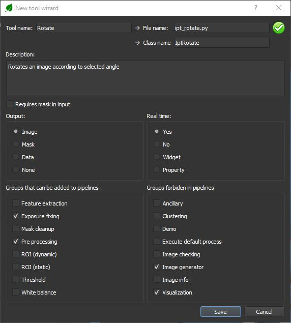
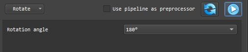
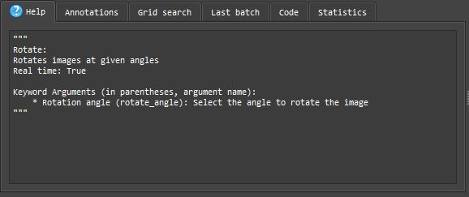
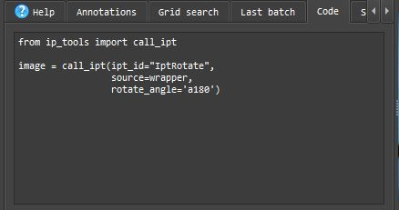
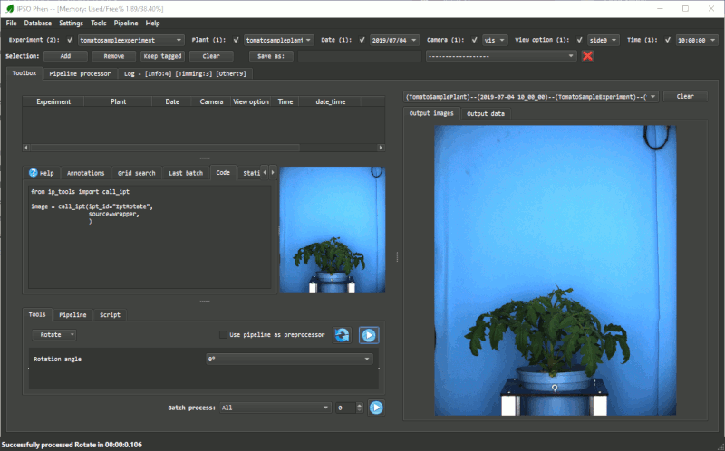
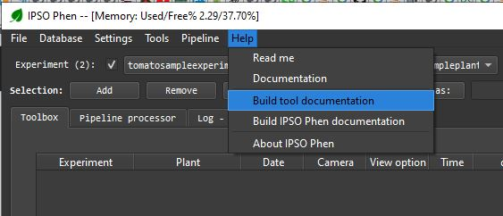

# Custom tools (I want more)

!!! warning
    Python Object Oriented Programing knowledge needed below

If you have an idea for a new image processing tool or you want to port an already existing one into IPSO Phen. As long as you understand Python Object Oriented programming it's relatively easy.

We're going to build a really simple tool that rotates an image

!!! warning
    Before creating your own tools set 
    ```python
    USE_PROCESS_THREAD = False
    ```
    in *ui_consts.py*.
    Otherwise you will not be able to debug your tool

## Some rules about tools that I think should be respected

- A tool should never overwrite delete or modify in any way a source image.
- 2 or more tools should never have the same name.
- If you create a tool, please make it available to everyone.
- Help files should always be generated.


## Create the skeleton

In the main menu select *File/New tool*, a wizard form should appear, cf. image below.  
  
We fill the wizard as follows:

- **Tool name**: Sets the name used in the UI, **File Name** and **Class name** are filled automatically.
- **Description**: Describe the tool, this string will be used all along the documentation.
- **Output**: Type of output selected
- **Real time**: Wether or not the tool will react when a widget is modified
- **Groups**: Groups to which the tool will be added, using in the UI and when positioning the tool in a pipeline

!!! warning
    Try to avoid real time if tool takes more than a second to process


If the icon on the top right corner is read, it means that a tool with the same name already exists. IPSO Phen **will not** override an existing tool.

Once we click on save we obtain the skeleton below

```python
from ip_base.ipt_abstract import IptBase


class IptRotate(IptBase):

    def build_params(self):
        self.add_enabled_checkbox()

    def process_wrapper(self, **kwargs):
        wrapper = self.init_wrapper(**kwargs)
        if wrapper is None:
            return False

        res = False
        try:
            if self.get_value_of('enabled') == 1:
                img = wrapper.current_image

                # Write your code here
                wrapper.store_image(img, 'current_image')
                res = True
            else:
                wrapper.store_image(wrapper.current_image, 'current_image')
                res = True
        except Exception as e:
            res = False
            wrapper.error_holder.add_error(f"Rotate FAILED, exception: {repr(e)}")
        else:
            pass
        finally:
            return res

    @property
    def name(self):
        return 'Rotate'

    @property
    def real_time(self):
        return True

    @property
    def result_name(self):
        return 'image'

    @property
    def output_kind(self):
        return 'image'

    @property
    def use_case(self):
        return ['Exposure fixing', 'Image generator', 'Pre-processing', 'Visualization']

    @property
    def description(self):
        return 'Rotates an image according to selected angle'

```

## Adding widgets

As we're making a simple rotation tool we're just going to add a combo box to our user interface. If you want to know more about available widgets you can check the [Demo tool documentation](ipt_IPT_Demo.md).

```python
def build_params(self):
    self.add_enabled_checkbox()
    self.add_combobox(
        name='rotate_angle',
        desc='Rotation angle',
        default_value='a0',
        values=dict(a0='0°', a90='90°', a180='180°', a270='270°'),
        hint='Select the angle to rotate the image'
    )
```

## The main method
Now we're just going to add some code to the main method to actually rotate the image.

!!! tip
    Don't forget to add any needed import.  
    For instance, here we use OpenCV which is imported with  
    import cv2  

```python
def process_wrapper(self, **kwargs):
    wrapper = self.init_wrapper(**kwargs)
    if wrapper is None:
        return False

    res = False
    try:
        if self.get_value_of('enabled') == 1:
            img = wrapper.current_image

            # Get the value of the combo box
            rotation_angle = self.get_value_of('rotate_angle')

            # Apply transformation
            root_file_name = wrapper.file_handler.file_name_no_ext
            if rotation_angle == 'a90':
                self.result = cv2.rotate(img, cv2.ROTATE_90_CLOCKWISE)
                image_name = f'{root_file_name}_r90'
            elif rotation_angle == 'a180':
                self.result = cv2.rotate(img, cv2.ROTATE_180)
                image_name = f'{root_file_name}_r180'
            elif rotation_angle == 'a270':
                self.result = cv2.rotate(img, cv2.ROTATE_90_COUNTERCLOCKWISE)
                image_name = f'{root_file_name}_r270'
            else:
                self.result = img
                image_name = f'{root_file_name}_r0'

            # Store the image
            self.wrapper.store_image(self.result, image_name)
            res = True
        else:
            wrapper.store_image(wrapper.current_image, 'current_image')
            res = True
    except Exception as e:
        res = False
        wrapper.error_holder.add_error(f"Rotate FAILED, exception: {repr(e)}")
    else:
        pass
    finally:
        return res
```

!!! info
    **Debugging custom tools**:  
    All tools are processed in a different thread which the Python debugger can't see. In order to be able to set breakpoints you must disable multi threading by changing the value of *USE_PROCESS_THREAD* to False in *ui_consts.py*.

!!! warning
    **DO NOT FORGET** to set it back to true afterwards

## The actual tool

The next time you launch IPSO Phen you should have:

#### The *Rotate* tool avalaible for selection with its UI 
<br>
#### The help tab should look like this like this

#### The code generation should update itself when you change the tool 


But most importantly, the tool should work.



## But wait there's more !

### Generating the mark down documentation

Click on *Help/Build tool documentation* to create a help file for the tool like [this one](ipt_CLAHE.md)
. All tool help files follow the same structure, when you click on *Build tool documentation*, the source image and the image on the output panel are used to generate the help. 

And then you can click on the menu item below to update IPSO Phen documentation so your tool will be included in the *Tools* section.