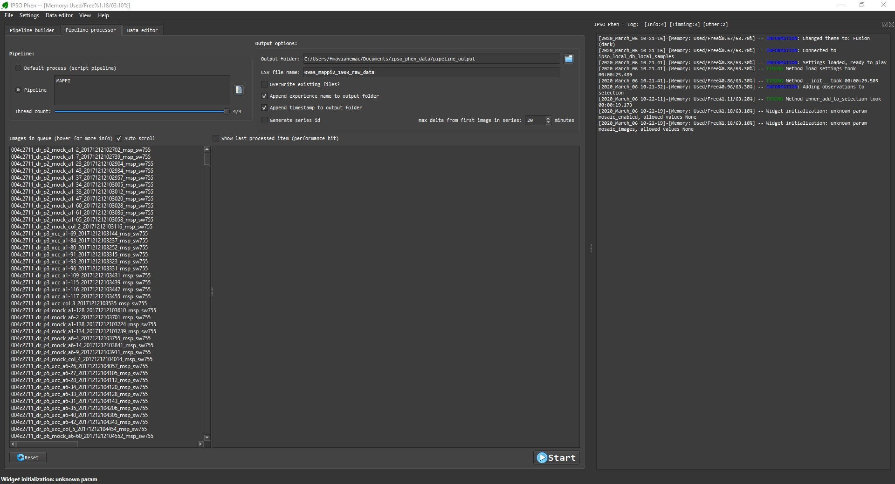
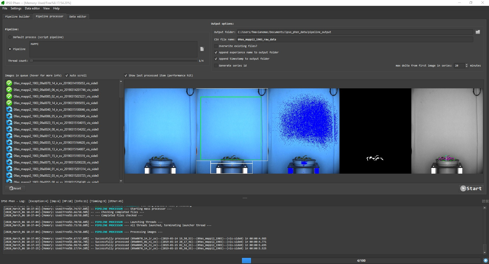

# First steps

## Loading images

Since IPSO Phen is high throughput oriented it parses full folders instead of loading single files.

!!! warning
  Parsing is recursive, ie images in all sub folders will be added to the catalog.

To add images to the file manager open the _File_ menu and select _Parse folders_. More on adding files in the [user interface](user_interface.md) section

## Tools

- All tools can be accessed through the "Tools" menu
- They're classified by their type
- One tool can have multiple types
- Existing types:
  - **Ancillary**: Tools mostly used inside other tools
  - **Assert...**: Tools used to check that things are as they should be, for example, "Assert mask position", checks that the current mask is within the boundaries of an ROI
  - **Clustering**: Clustering tools
  - **Create an ROI**: Creates ROIs...
  - **Demo**: Demo tools, start here if you want to understand how to create/edit tools
  - **Execute default class pipeline**: Execute a class pipeline linked to the selected image experiment, if no class pipeline is available an error will be reported
  - **Exposure fixing**: Fix image exposure, the resulting image will be used for color analysis
  - **Feature extraction**: Tools to extract features from a segmented image
  - **Image generator**: Creates and/or saves images.
  - **Image info**: Gives info about the current image
  - **Mask cleanup**: Cleans a coarse mask generated by threshold tools
  - **Pre-processing**: Transform the image to help segmentation, the image may not retain it's properties. Changes here will be ignored when extracting features
  - **Threshold**: Threshold tools
  - **Visualization**: Visualization tools
  - **White balance**: Tools to help change white balance, depending on where those tools are set in the pipeline they or may not be ignored when extracting features
- Upon selecting a tool the help tab and the tool interface is updated
- If the tool reacts in real time the result will be displayed on the "Output image" tab, if not you need to click on the play button next to "Use pipeline as preprocessor"

## Pipelines

Pipelines are the reason this program exists, a whole page is dedicated to them, you can find it [here](pipelines.md). This is the most important part of the documentation, it you only read one thing it should be [this](pipelines.md).

## Testing

- At any time a test run can be executed on all or part of the images present in the quick access list by clicking on the "Play" button next to "Batch process" at the bottom left of the UI
- Three test modes are available:
  - **"All"**: Will test all images in the quick access list, this will ignore the spin box
  - **"First n"**: Test the first **n** images, **n** refers to the number displayed in the spin box
  - **"Random n"**: Test **n** random images, **n** refers to the number displayed in the spin box

## Building image data file

### Launching the analysis

Once a pipeline is ready it can be executed on any number of images in the "Pipeline processor" tab. Options can be set before launching the mass process, only thread count, which the number of images processed at the same time can be modified afterwards.

### Progress feedback

Once the process starts, the progress can be viewed on the "Log" panel. At any time the process can be stopped, afterwards, if the process is restarted the already analysed images will be skipped (partial results are stored) unless the setting to overwrite is checked.

### CSV file

After the all the images are analysed, a CSV file will be generated in the selected output folder.
