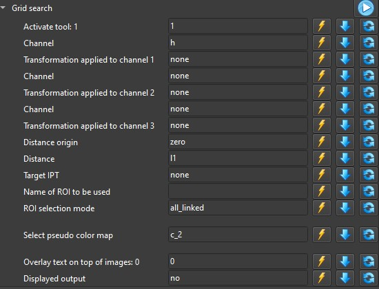

# Grid search

The grid search feature is appended at the button af any tool added to a [pipeline](pipelines.md)

## Too many widgets

Some tools have too many parameters to take the time to play with each one in order to find the good combination. To address this issue we can use the grid search, a way to explore large amount of possible combinations in one step.

For example, the "image from distance" tool can produce nice results but has too many options to explore manually in an exhaustive way.

## The grid search node

### Parameter configuration

In the image above all the parameters are set to their default value, which doesn't do much as it only runs the default configuration. If we want to test more configurations, the edit widgets can be filled as follows:

- **Single value**: This parameter will have the same value for all the grid search process.
- **Comma separated list**: All the values in the list will be tested during the grid search.
- **Range and step**: A list will be generated starting from the lowest value to the upper value in steps, for example 0-10;2 will generate 0,2,4,6,8,10 this is only available for numerical widgets.

There are three buttons next to each parameter:

- : Automatically fills the variable options.
- : Copies the value present in the tool.
- : Resets value to default.

### Lets get crazy !!!

So lets try to review all possible choices generated by the automatic filling method.

If we actually try to run this grid search it would generate 781700352 images, even if we had enough memory to hold them, at one image per second it would take about 24 years to generate all the images.

### Lets try something else then

We are going to try a different approach, first we're going to reduce the amount of solutions to check, we're going to activate the random output mode so we don't get to see similar results appear one after the other and we're going to print the tool configuration for each image displayed.

And here's the result.

The false color images give an indication of threshold success and the text on the image allows to set the parameters on the actual tool.
