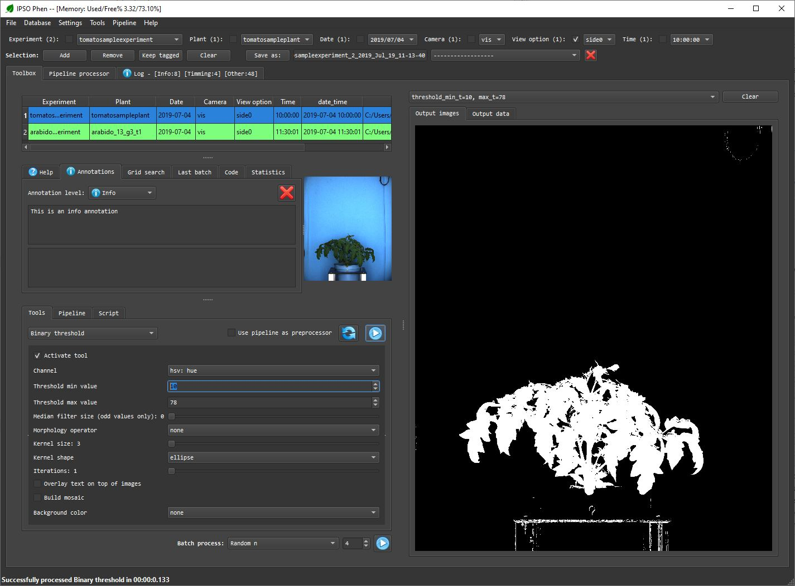

# Welcome to the documentation for IPSO Phen

The rise in popularity of high throughput plant phenotyping facilities leads to a large volume of images. To address the increasing demand and diversity of image analysis needs, we developed "IPSO Phen", an all-in-one program to build, test and execute image-processing pipelines by chaining easily customizable tools.

## Introduction

Toulouse Plant Microbe Phenotyping (TPMP) is a high throughput platform located on the INRA Occitanie-Toulouse campus in France. It has five camera groups in two robots settings taking pictures from the top or the side of the plant. Species studied to date have been _Marchantia_, _Arabidopsis_, _Medicago_, Tomato, Tobacco, Sunflower, Eucalyptus, Wheat and _Brachypodium_. This large amount of possible combinations generated the need for a tool to create, test and run analysis pipelines. After evaluating the software tools freely available, we created IPSO Phen, an all-in-one image processing toolbox.
IPSO Phen groups in a single interface around fifty different image-processing tools that can be combined into pipelines. The settings of both tools and pipelines can be thoroughly tested on fixed or random sets of images from the experiments. IPSO Phen can access images either from a file system or through a database.

## [Image processing tools](tools.md)

IPSO Phen comes with a variety of image-processing tools that belong to different categories such as pre-processing, threshold, segmentation, feature extraction, etc… Each tool generates its own interface to customize and test its settings.  
Among the available tools, there is an image pre-processor based on Otsu’s automatic clustering-based threshold method, various classic threshold methods and an advanced contour cleaning tool able to remove noise while keeping split contours.  
Next to the tool selector, the question mark button displays a help window for the selected tool and next to it the "Show code" button shows the code that can be pasted directly into a python script.

## [Pipelines](pipelines.md)

The user can arrange any number of image processing tools into a customizable pipeline that can be fully edited, saved and restored for later usage. Pipelines can also arrange a series of tools into groups if needed. More on pipelines and groups [here](pipelines.md).

## [Testing](testing.md)

At any point, the user can choose to test the current tool or pipeline configuration on any number of images with a single click. Test images can be selected manually, taken from a saved selection or randomly, or, any combination of these three methods. The results of the test can be accessed with a combo box or saved as a video to be reviewed later. This feature facilitates a large number of tests, which in turn will improve the quality of the analysis.

## [Grid search](grid_search.md)

The grid search allows the exploration of a whole solution space defined by a customized range for each setting. It is an easy way to check a large amount of settings with just one click. The results can be reviewed on the user interface or be converted into a video. Grid search options can be accessed from every tool added to a pipeline.

## Advanced features

### [Class pipelines](class_pipelines.md)

For advanced python users. Class pipelines can be automatically selected by the program when using the default tool. They allow the same level of customization than script pipelines. These class pipelines are scripts manually created by the user.

### [Adding tools](custom_tools.md)

Even if IPSO Phen comes with a large (and expanding) set of image processing tools, some users may want to add additional tools that they have created or from an existing toolkit like PlantCV [1]. To that end, we offer an easy way to create or add tools to the user interface (UI) where widgets are added in a descriptive way and all callbacks and notifications are handled by the program.

### [File handlers](ipapi.file_handlers.md)

By default IPSO Phen extracts the information needed for image managing from the file name as seen on the [user interface section](user_interface.md).
