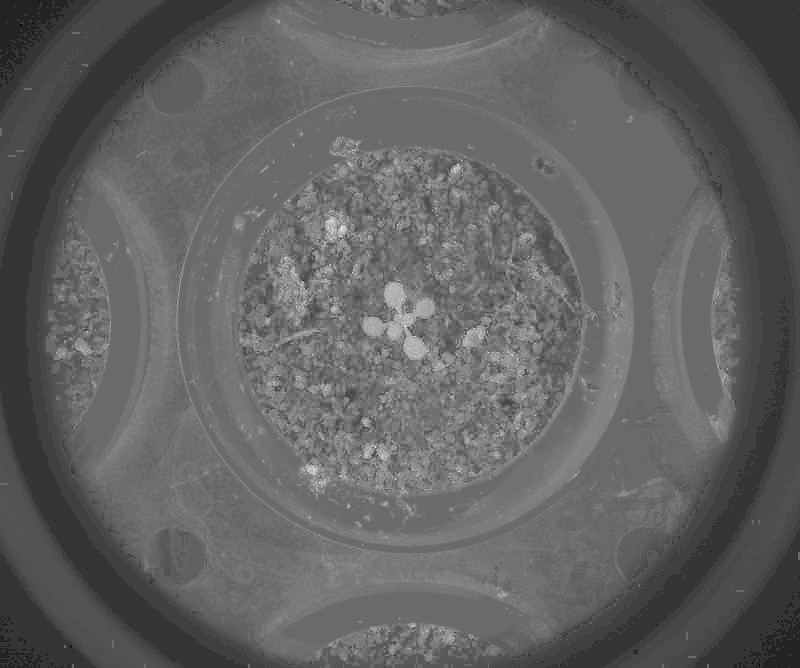

# Channel operation

## Description

Performs arithmetic operation between up to 3 channels<br>**Real time**: True

## Usage

- **Pre-processing**: Transform the image to help segmentation, the image may not retain it's properties. Changes here will be ignored when extracting features

## Parameters

- Channel 1 (channel_1): (default: bl)
- Weight of the first channel (alpha): (default: 100)
- Arithmetic operator (op1): Operator to use with operands (default: plus)
- Channel 2 (channel_2): (default: rd)
- Weight of the second channel (beta): (default: 100)
- Arithmetic operator (op2): Operator to use with operands (default: plus)
- Channel 3 (channel_3): (default: gr)
- Weight of the third channel (gamma): (default: 100)
- Set negative values to 0 (cut_negative_values): (default: 0)
- Select pseudo color map (color_map): (default: c_2)
- use color palette (use_palette): Use color palette in postprocessing (default: 0)
- Build mosaic (build_mosaic): Choose mosaic type to display (default: no)
- Overlay text on top of images (text_overlay): Draw description text on top of images (default: 0)

---

## Example

### Source


### Parameters/Code

Default values are not needed when calling function

```python
from ipapi.ipt import call_ipt

channel = call_ipt(ipt_id="IptChannelOperation",
                   source="arabido_sample_plant.jpg",
                   channel_1='rd',
                   channel_2='gr',
                   op2='div',
                   channel_3='bl')
```

### Result


