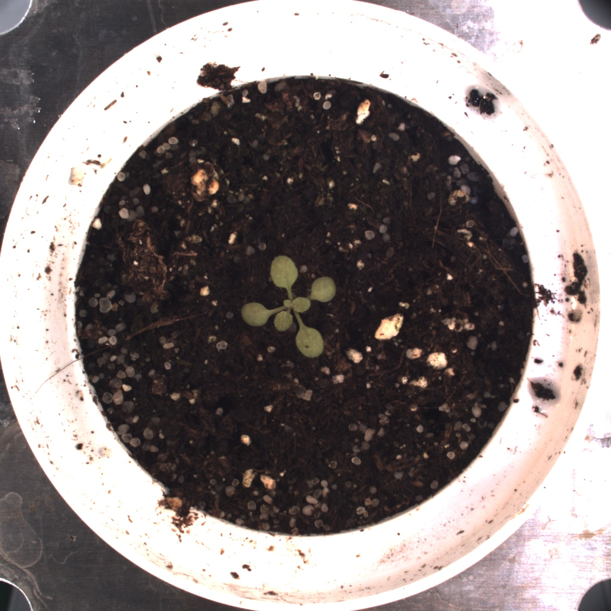

# Crop

## Description

'Crop image or mask to rectangular ROI
**Real time**: True

## Usage

- **Pre processing**: Transform the image to help segmentation, 
    the image may not retain it's 
    properties. Changes here will be ignored when extracting features

## Parameters

- Activate tool (enabled): Toggle whether or not tool is active (default: 1)
- Select source (source_selector): Select which image will be used as source (default: current_image)
- Name of ROI to be used (roi_name): Crop Image/mask to ROI, only one ROI accepted (default: )

## Example

### Source


### Parameters/Code

Default values are not needed when calling function

```python
from ipapi.base.ipt_functional import call_ipt

image = call_ipt(
    ipt_id="IptCrop",
    source="(arabido_13_g3_t1)--(2019-07-04 11_30_01)--(ArabidopsisSampleExperiment)--(vis-side0).jpg",
    return_type="result",
    roi_name='keep_roi'
)
```

### Result image



### Result data

|  key  | Value |
| :---: | :---: |
