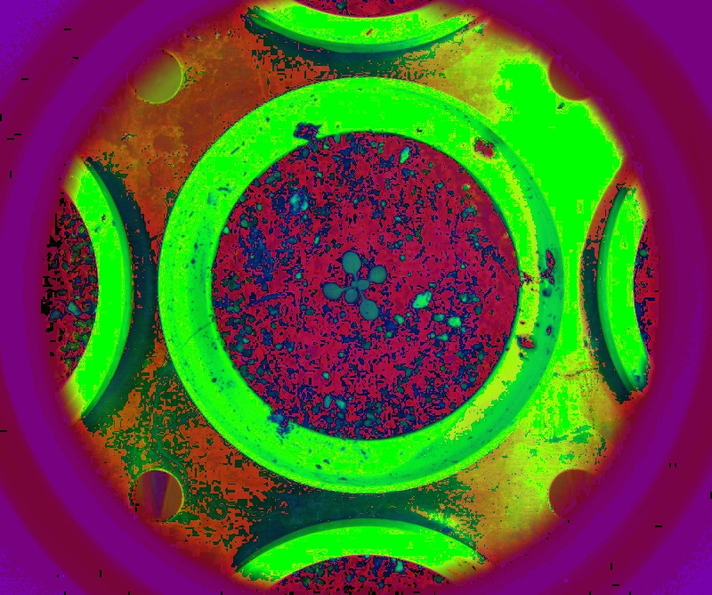

# Custom channels

## Description

Builds a mask or a channel by comparing pixels to average value.<br>**Real time**: True

## Usage

- **Pre-processing**: Transform the image to help segmentation, the image may not retain it's properties. Changes here will be ignored when extracting features
- **Threshold**: Creates a mask that keeps only parts of the image

## Parameters

- Activate tool (enabled): Toggle whether or not tool is active (default: 1)
- Select source file type (source_file): no clue (default: source)
- Channel 1: (channel_1): (default: bl)
- Invert channel 1 (invert_channel_1): (default: 0)
- Transformation applied to channel 1 (transformation_channel_1): (default: none)
- Channel 2: (channel_2): (default: gr)
- Invert channel 2 (invert_channel_2): (default: 0)
- Transformation applied to channel 2 (transformation_channel_2): (default: none)
- Channel 3: (channel_3): (default: rd)
- Invert channel 3 (invert_channel_3): (default: 0)
- Transformation applied to channel 3 (transformation_channel_3): (default: none)
- Output mode: (post_process): (default: rgb)
- Grey scale palette: (color_map): Grey scale palette (grey scale output only) (default: c_2)
- Build mosaic (build_mosaic): Choose mosaic type to display (default: no)
- Overlay text on top of images (text_overlay): Draw description text on top of images (default: 0)

---

## Example

### Source


### Parameters/Code

Default values are not needed when calling function

```python
from ipapi.ipt import call_ipt

image = call_ipt(ipt_id="IptCustomChannel",
                 source="arabido_sample_plant.jpg",
                 channel_1='s',
                 channel_2='l',
                 channel_3='h')
```

### Result


