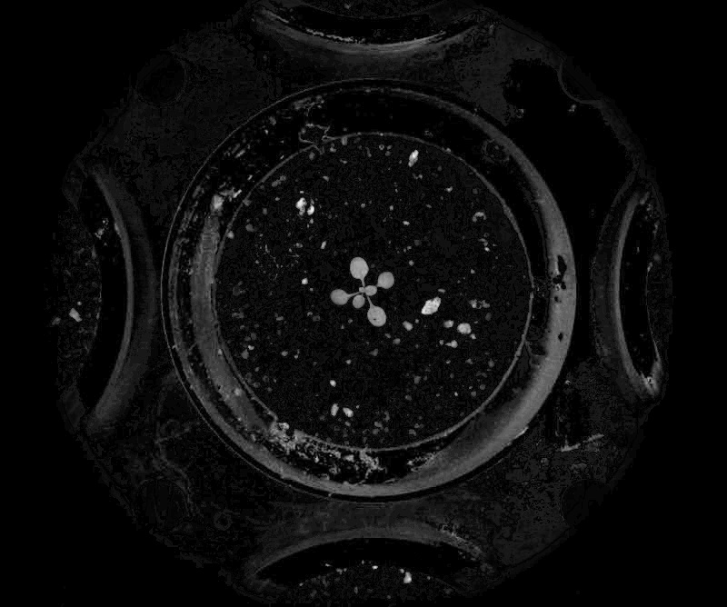

# Distance threshold
## Description
Build a mask from distance calculation<br>**Real time**: True
## Usage
- **Threshold**: Creates a mask that keeps only parts of the image
- **Pre-processing**: Transform the image to help segmentation, the image may not retain it's properties. Changes here will be ignored when extracting features
## Parameters
- Activate tool (enabled): Toggle whether or not tool is active (default: 1)
- Channel (channel_1):  (default: h)
- Transformation applied to channel 1 (transformation_1):  (default: none)
- Channel (channel_2):  (default: none)
- Transformation applied to channel 2 (transformation_2):  (default: none)
- Channel (channel_3):  (default: none)
- Transformation applied to channel 3 (transformation_3):  (default: none)
- Distance origin (origin):  (default: zero)
- Distance (distance):  (default: l1)
- Target IPT (tool_target): no clue (default: none)
- Postprocessing option (post_processing):  (default: none)
- Select pseudo color map (color_map):  (default: c_2)
- Threshold min value (min_t):  (default: 0)
- Threshold max value (max_t):  (default: 255)
- Median filter size (odd values only) (median_filter_size):  (default: 0)
- Morphology operator (morph_op):  (default: none)
- Kernel size (kernel_size):  (default: 3)
- Kernel shape (kernel_shape):  (default: ellipse)
- Iterations (proc_times):  (default: 1)
- Overlay text on top of images (text_overlay): Draw description text on top of images (default: 0)
- Displayed output (build_mosaic): Choose mosaic type to display (default: no)
--------------
## Example
### Source


### Parameters/Code
Default values are not needed when calling function
```python
from ip_tools import call_ipt

mask = call_ipt(ipt_id="IptThresholdDistance",
                source="arabido_sample_plant.jpg",
                transformation_1='sigmoid',
                channel_2='gr',
                channel_3='b',
                transformation_3='sqrt',
                origin='mean',
                distance='inv_chebyshev')
```
### Result

