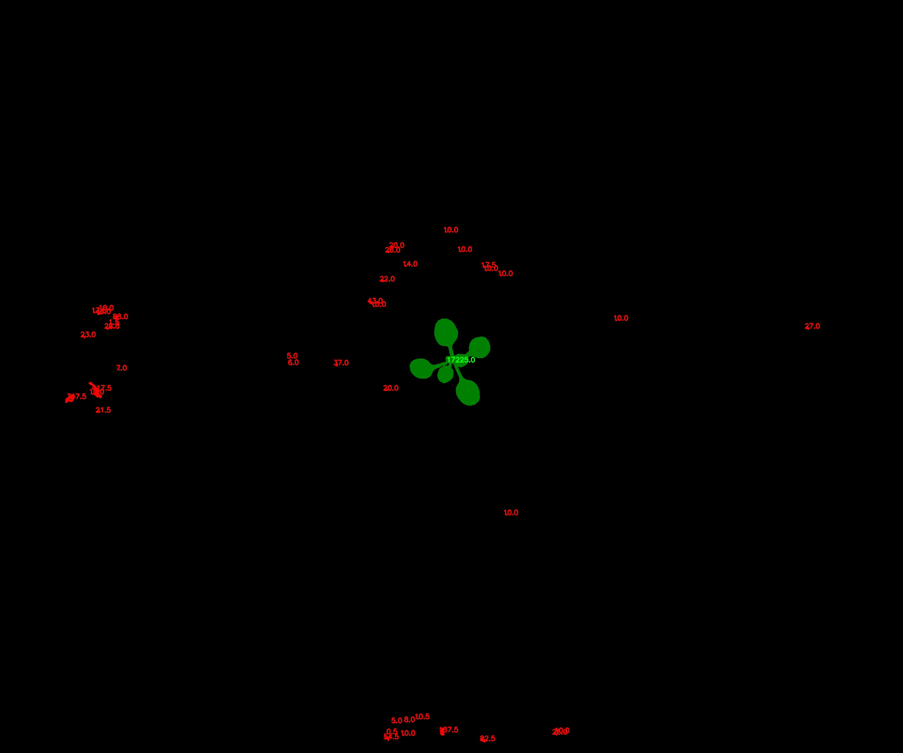

# Filter contour by size

## Description

'Keep or descard contours according to their size
**Real time**: False

## Usage

- **Mask cleanup**: Cleans a coarse mask generated by threshold tools

## Parameters

- Activate tool (enabled): Toggle whether or not tool is active (default: 1)
- Lower bound limit (min_threshold): Only contours bigger than lower limit bound will be kept (default: 0)
- Upper bound limit (max_threshold): Only contours smaller than lower limit bound will be kept (default: 100000000)
- Name of ROI to be used (roi_names): Operation will only be applied inside of ROI (default: )
- ROI selection mode (roi_selection_mode):  (default: all_linked)

## Example

### Source


### Parameters/Code

Default values are not needed when calling function

```python
from ipapi.base.ipt_functional import call_ipt

mask = call_ipt(
    ipt_id="IptFilterContourBySize",
    source="(arabido_13_g3_t1)--(2019-07-04 11_30_01)--(ArabidopsisSampleExperiment)--(vis-side0).jpg",
    return_type="result",
    min_threshold=500
)
```

### Result


