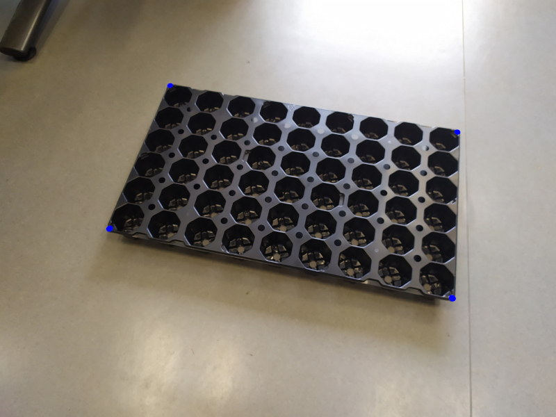
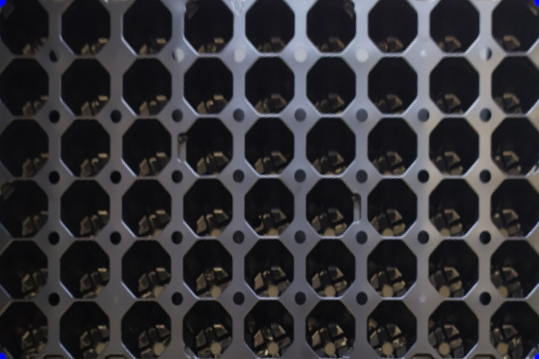

# Fix perspective

## Description

Fixes perspective using four dots to detect rectangle boundary.  
Use the included threshold utility to detect the dots.  
**Real time**: True

## Usage

- **Exposure fixing**: Fix image exposure, the resulting image will be used for color analysis
- **Pre processing**: Transform the image to help segmentation, the image may not retain it's properties. Changes here will be ignored when extracting features

## Parameters

- Activate tool (enabled): Toggle whether or not tool is active (default: 1)
- Module mode (mode): (default: threshold)
- Channel 1 (c1): (default: h)
- Min threshold for channel 1 (c1_low): (default: 0)
- Max threshold for channel 1 (c1_high): (default: 255)
- Channel 2 (c2): (default: none)
- Min threshold for channel 2 (c2_low): (default: 0)
- Max threshold for channel 2 (c2_high): (default: 255)
- Channel 3 (c3): (default: none)
- Min threshold for channel 3 (c3_low): (default: 0)
- Max threshold for channel 3 (c3_high): (default: 255)
- How to merge thresholds (merge_mode): (default: multi_and)
- Morphology operator (morph_op): (default: none)
- Kernel size (kernel_size): (default: 3)
- Kernel shape (kernel_shape): (default: ellipse)
- Iterations (proc_times): (default: 1)
- Minimal dot size (surface) (min_dot_size): (default: 30)
- Maximal dot size (surface) (max_dot_size): (default: 3000)
- Destination width (dst_width): (default: 800)
- Destination height (dst_height): (default: 600)

## Example

### Source



### Parameters/Code

Default values are not needed when calling function

```python
from ipapi.ipt import call_ipt

image = call_ipt(
    ipt_id="IptFixPerspective",
    source="(perspective)--(2019-10-16 11_30_01)--(perspective_sample)--(vis-top).jpg",
    return_type="result",
    mode='fix_perspective',
    c1='b',
    c1_high=50,
    min_dot_size=10,
    dst_width=900
)
```

### Result


