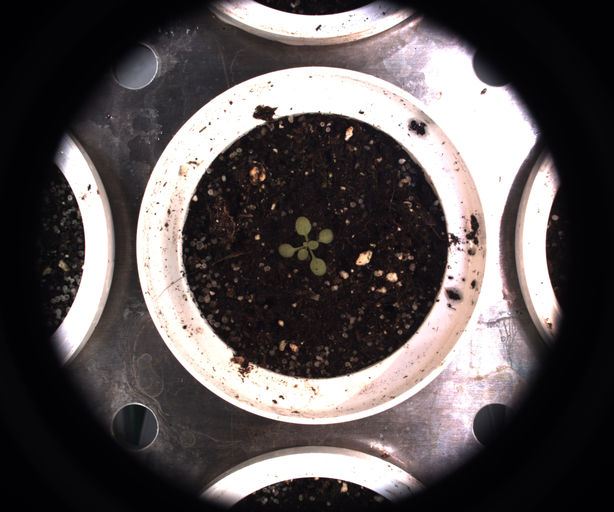

# Gaussian filtering

## Description

'Apply Gaussian filter
**Real time**: True

## Usage

- **Mask cleanup**: Cleans a coarse mask generated by threshold tools
- **Pre processing**: Transform the image to help segmentation, 
    the image may not retain it's 
    properties. Changes here will be ignored when extracting features

## Parameters

- Activate tool (enabled): Toggle whether or not tool is active (default: 1)
- Source (source):  (default: current_image)
- Gaussian filter size (odd values only) (kernel_size):  (default: 3)

## Example

### Source



### Parameters/Code

Default values are not needed when calling function

```python
from ipso_phen.ipapi.base.ipt_functional import call_ipt

image = call_ipt(
    ipt_id="IptGaussianFiltering",
    source="(arabido_13_g3_t1)--(2019-07-04 11_30_01)--(ArabidopsisSampleExperiment)--(vis-side0).jpg",
    return_type="result",
    kernel_size=30
)
```

### Result


