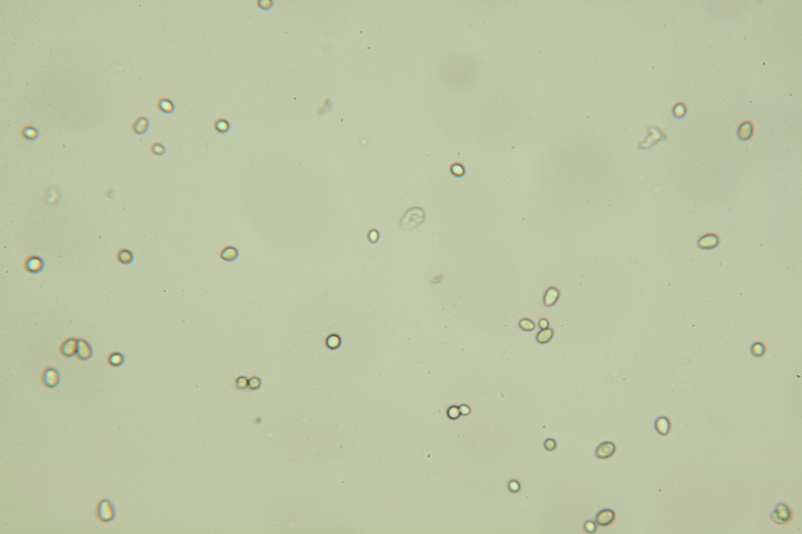
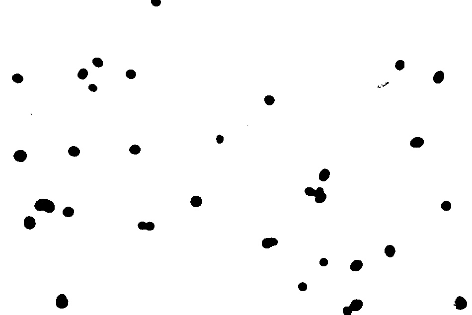

# Ilastik inference

## Description

'Use an Ilastik project to generate a mask for the current image or an image loaded from harddrive
**Real time**: False

## Usage

- **Threshold**: Creates a mask that keeps only parts of the image

## Parameters

- Activate tool (enabled): Toggle whether or not tool is active (default: 1)
- Path to Ilastik folder (ilastik_path):  (default: )
- Ilastik model name (ilastik_model): Full path to an Ilastik project (default: )
- Image output format (src_output_format):  (default: source)
- Subfolders (src_subfolders): Subfolder names separated byt "," (default: )
- Output naming convention (src_output_name):  (default: as_source)
- Prefix (src_prefix): Use text as prefix (default: )
- Suffix (src_suffix): Use text as suffix (default: )
- Replace unsafe caracters (src_make_safe_name): Will replace *"/\[]:;|=,<> with "_" (default: 1)
- Image output format (dst_output_format):  (default: source)
- Subfolders (dst_subfolders): Subfolder names separated byt "," (default: )
- Output naming convention (dst_output_name):  (default: as_source)
- Prefix (dst_prefix): Use text as prefix (default: )
- Suffix (dst_suffix): Use text as suffix (default: )
- Replace unsafe caracters (dst_make_safe_name): Will replace *"/\[]:;|=,<> with "_" (default: 1)
- Overwrite existing mask (overwrite):  (default: 0)

## Example

### Source



### Parameters/Code

Default values are not needed when calling function

```python
from ipso_phen.ipapi.base.ipt_functional import call_ipt

mask = call_ipt(
    ipt_id="IptIlastikInference",
    source="IMG_0300.jpg",
    return_type="result"
)
```

### Result


