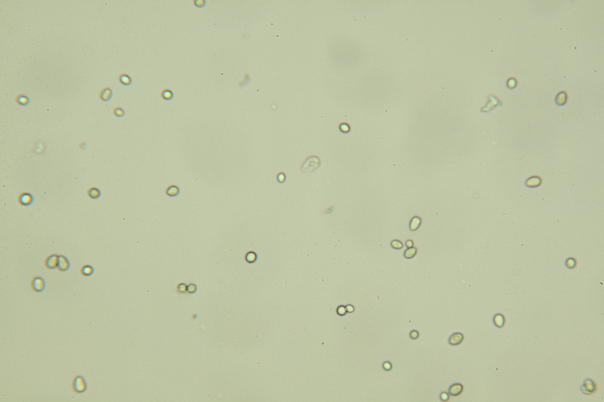

# Image scaler

## Description

'Scale image according to factor
**Real time**: True

## Usage

- **Image generator**: Creates one or more images from a selected image
- **Visualization**: Visualization tools

## Parameters

- Activate tool (enabled): Toggle whether or not tool is active (default: 1)
- Save generated image (save_image):  (default: 0)
- Name in csv (img_name):  (default: img)
- Image output format (output_format):  (default: source)
- Subfolders (subfolders): Subfolder names separated byt "," (default: )
- Output naming convention (output_name):  (default: as_source)
- Prefix (prefix): Use text as prefix (default: )
- Suffix (suffix): Use text as suffix (default: )
- Replace unsafe caracters (make_safe_name): Will replace *"/\[]:;|=,<> with "_" (default: 1)
- Add linked images (grab_linked_images): Crop also all linked images (default: 0)
- Scaling direction (scale_direction):  (default: down)
- Scale factor (scale_factor):  (default: 2)
- Store transformation (store_transformation): Store transformation so it will be applied to linked images (default: 1)

## Example

### Source



### Parameters/Code

Default values are not needed when calling function

```python
from ipso_phen.ipapi.base.ipt_functional import call_ipt

image = call_ipt(
    ipt_id="IptImageScaler",
    source="IMG_0300.jpg",
    return_type="result",
    scale_factor=20
)
```

### Result image


### Result data

|         key         |        Value        |
|:-------------------:|:-------------------:|
|camera|unknown|
|date_time|2021-01-19 14:19:12|
|enabled|1|
|experiment|gav_mildiou|
|grab_linked_images|0|
|image_name|cropped_image|
|img_height|3168|
|img_name|img|
|img_width|4752|
|ipt|Image scaler|
|ipt_class_name|IptImageScaler|
|make_safe_name|1|
|output_format|source|
|output_name|as_source|
|plant|img_0300|
|prefix||
|save_image|0|
|scale_direction|down|
|scale_factor|20|
|scaled_height|158|
|scaled_width|238|
|store_transformation|1|
|subfolders||
|suffix||
|view_option|.jpg|
