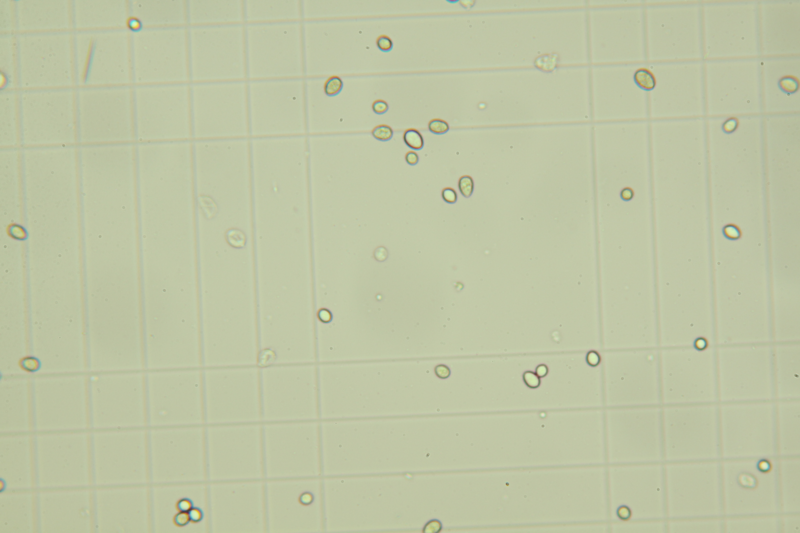

# Load mask

## Description

'Load a mask from a file
**Real time**: True

## Usage

- **Threshold**: Creates a mask that keeps only parts of the image

## Parameters

- Activate tool (enabled): Toggle whether or not tool is active (default: 1)
- Image output format (output_format):  (default: source)
- Subfolders (subfolders): Subfolder names separated byt "," (default: )
- Output naming convention (output_name):  (default: as_source)
- Prefix (prefix): Use text as prefix (default: )
- Suffix (suffix): Use text as suffix (default: )
- Replace unsafe caracters (make_safe_name): Will replace *"/\[]:;|=,<> with "_" (default: 1)
- Invert mask (invert_mask):  (default: 0)
- Scaling direction (scale_direction):  (default: none)
- Scale factor (scale_factor):  (default: 1)

## Example

### Source



### Parameters/Code

Default values are not needed when calling function

```python
from ipso_phen.ipapi.base.ipt_functional import call_ipt

mask = call_ipt(
    ipt_id="IptLoadMask",
    source="IMG_0292.jpg",
    return_type="result"
)
```

### Result


