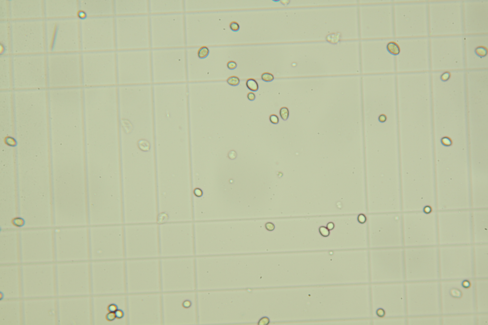
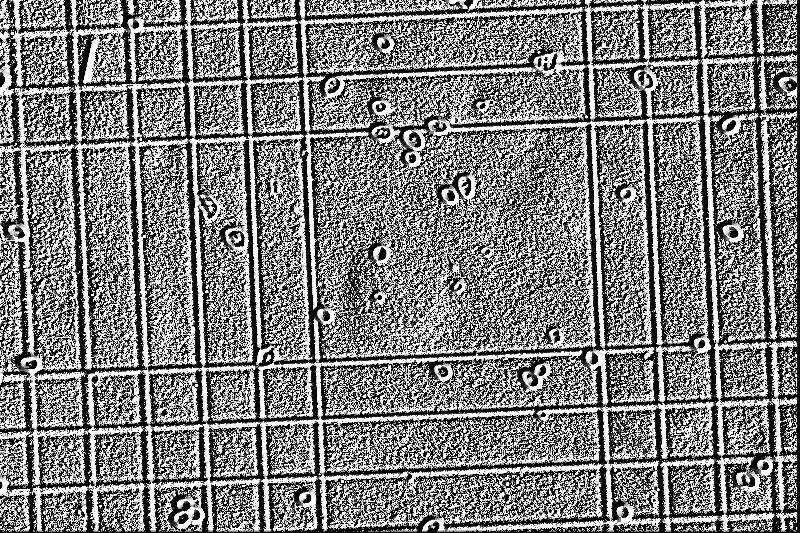

# Local binary pattern threshold

## Description

Gray scale and rotation invariant LBP (Local Binary Patterns).  
        LBP is an invariant descriptor that can be used for texture classification.
**Real time**: False

## Usage

- **Threshold**: Creates a mask that keeps only parts of the image
- **Visualization**: Visualization tools
- **Pre processing**: Transform the image to help segmentation, 
    the image may not retain it's 
    properties. Changes here will be ignored when extracting features

## Parameters

- Activate tool (enabled): Toggle whether or not tool is active (default: 1)
- Channel (channel):  (default: l)
- Number of circularly symmetric neighbor (P): Number of circularly symmetric neighbor set points (quantization of the angular space) (default: 24)
- Radius of circle (R): Radius of circle (spatial resolution of the operator) (default: 3)
- Method to determine the pattern (method):  (default: default)
- Transformation applied to output (transformation):  (default: none)
- Cut x%% lower values (lower_cut): Increase to smooth low frequency textures regions and add detail to high frequencies (default: 0)
- Cut x%% upper values (upper_cut): Increase to smooth high frequency textures regions and add detail to low frequencies (default: 0)
- Postprocessing option (post_processing):  (default: none)
- Threshold min value (min_t):  (default: 0)
- Threshold max value (max_t):  (default: 255)
- Median filter size (odd values only) (median_filter_size):  (default: 0)
- Morphology operator (morph_op):  (default: none)
- Kernel size (kernel_size):  (default: 3)
- Kernel shape (kernel_shape):  (default: ellipse)
- Iterations (proc_times):  (default: 1)
- Select pseudo color map (color_map):  (default: c_2)

## Example

### Source



### Parameters/Code

Default values are not needed when calling function

```python
from ipso_phen.ipapi.base.ipt_functional import call_ipt

image = call_ipt(
    ipt_id="IptLocalBinaryPatternThreshold",
    source="IMG_0292.jpg",
    return_type="result"
)
```

### Result


