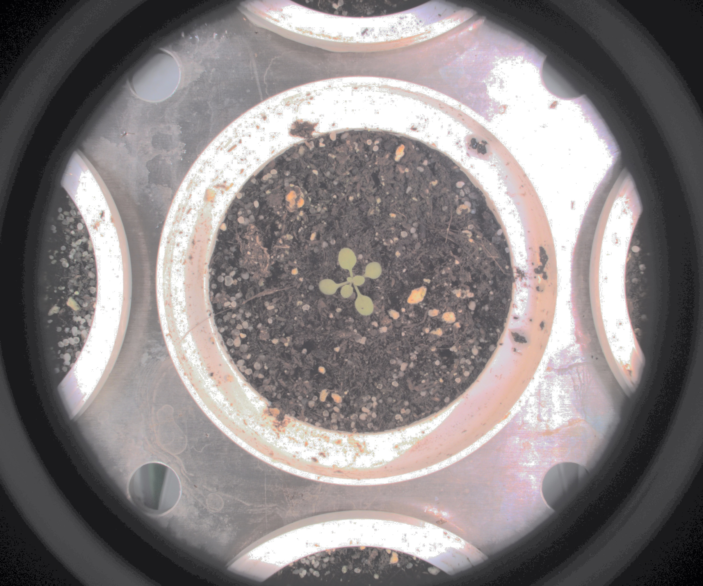

# Normalize Image

## Description

'Normalize image
**Real time**: True

## Usage

- **Exposure fixing**: Fix image exposure, the resulting image will be used for color analysis
- **Pre processing**: Transform the image to help segmentation, 
    the image may not retain it's 
    properties. Changes here will be ignored when extracting features

## Parameters

- Activate tool (enabled): Toggle whether or not tool is active (default: 1)

## Example

### Source


### Parameters/Code

Default values are not needed when calling function

```python
from ipapi.base.ipt_functional import call_ipt

image = call_ipt(
    ipt_id="IptNormalize",
    source="(arabido_13_g3_t1)--(2019-07-04 11_30_01)--(ArabidopsisSampleExperiment)--(vis-side0).jpg",
    return_type="result"
)
```

### Result


