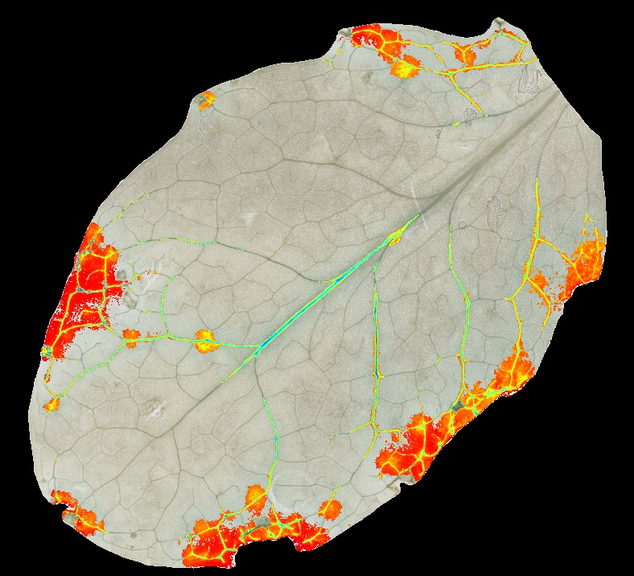

# Partial Analysis

## Description

'Analyse a part of the mask
**Real time**: True

## Usage

- **Feature extraction**: Tools to extract features from a segmented image

## Parameters

- Activate tool (enabled): Toggle whether or not tool is active (default: 1)
- Channel (channel):  (default: h)
- Invert mask (invert):  (default: 0)
- Threshold min value (min_t):  (default: 0)
- Threshold max value (max_t):  (default: 255)
- Median filter size (odd values only) (median_filter_size):  (default: 0)
- Morphology operator (morph_op):  (default: none)
- Kernel size (kernel_size):  (default: 3)
- Kernel shape (kernel_shape):  (default: ellipse)
- Iterations (proc_times):  (default: 1)
- Channels to analyze (channels_to_analyse): Select channels to be analyzed, possible values are:
            rd, gr, bl, h, s, v, l, a, b, wl_520, wl_550, wl_671, wl_680, wl_720, wl_800, wl_905
            channels must be separated by ',' (default: )
- Ratio between parts of the mask (ratio):  (default: 1)
- CSV prefix (csv_prefix):  (default: partial)

## Example

### Source


### Parameters/Code

Default values are not needed when calling function

```python
from ipso_phen.ipapi.base.ipt_functional import call_ipt

mask = call_ipt(
    ipt_id="IptPartialAnalysis",
    source="20200306_10dpi_Col-0_pot-grille_jiffy_spray_AC8_20200716133717_a.jpg",
    return_type="result"
)
```

### Result image



### Result data

|            key             |        Value        |
| :------------------------: | :-----------------: |
|  blue_partial_hsv_h_mean   |  80.46735184458399  |
| blue_partial_hsv_h_std_dev |  5.970197901522939  |
|  blue_partial_hsv_s_mean   | 40.523891287284144  |
| blue_partial_hsv_s_std_dev | 29.051983200325797  |
|  blue_partial_hsv_v_mean   |  185.0083644034537  |
| blue_partial_hsv_v_std_dev | 30.927115345477702  |
|     blue_partial_ratio     | 0.11891677459250703 |
