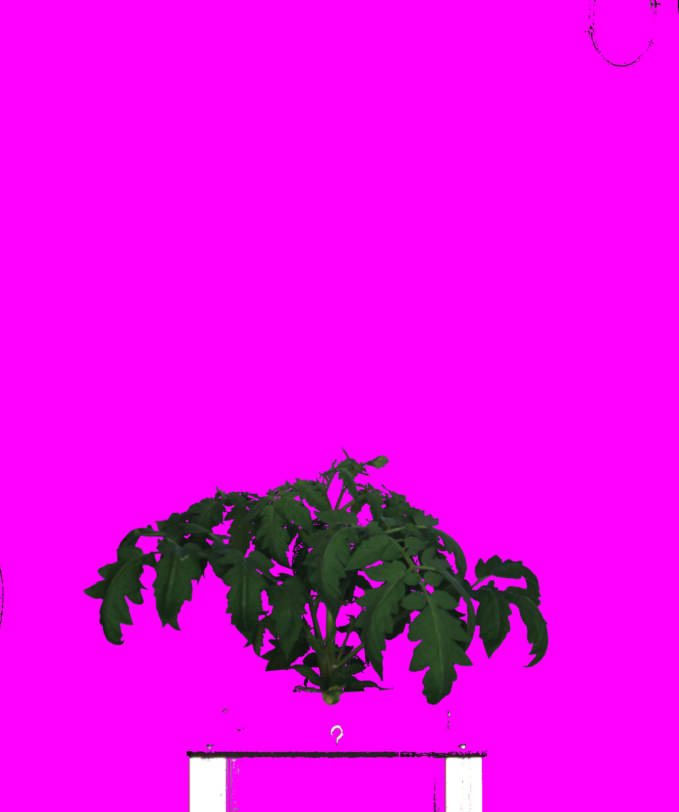

# Partial posterizer v2

## Description

Replaces dominant colors by other colors. Different algorithm from V1
**Real time**: True

## Usage

- **Pre processing**: Transform the image to help segmentation, 
    the image may not retain it's 
    properties. Changes here will be ignored when extracting features

## Parameters

- Activate tool (enabled): Toggle whether or not tool is active (default: 1)
- Color to use to replace blue dominant pixels (blue_color): Replace value of pixels where blue is dominant and represents more than % value by selected color (default: none)
- Blue channel threshold value (post_blue_value): Blue pixel value threshold (as percentage) (default: 100)
- Color to use to replace green dominant pixels (green_color): Replace value of pixels where green is dominant and represents more than % value by selected color (default: none)
- Green channel threshold value (post_green_value): Green pixel value threshold (as percentage) (default: 100)
- Color to use to replace red dominant pixels (red_color): Replace value of pixels where red is dominant and represents more than % value by selected color (default: none)
- Red channel threshold value (post_red_value): Red pixel value threshold (as percentage) (default: 100)

## Example

### Source


### Parameters/Code

Default values are not needed when calling function

```python
from ipapi.base.ipt_functional import call_ipt

image = call_ipt(
    ipt_id="IptPartialPosterizerV2",
    source="(TomatoSamplePlant)--(2019-07-04 10_00_00)--(TomatoSampleExperiment)--(vis-side0).jpg",
    return_type="result",
    blue_color='fuchsia'
)
```

### Result


