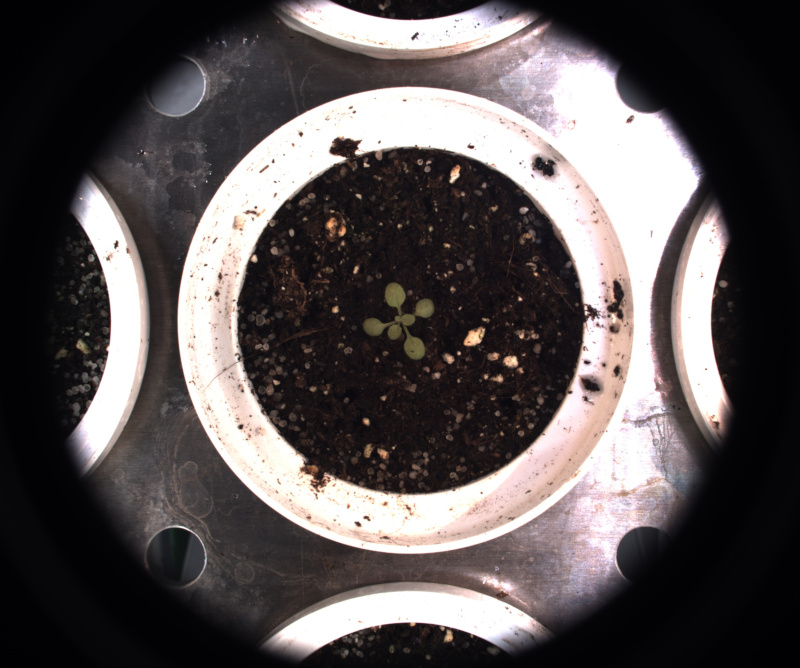
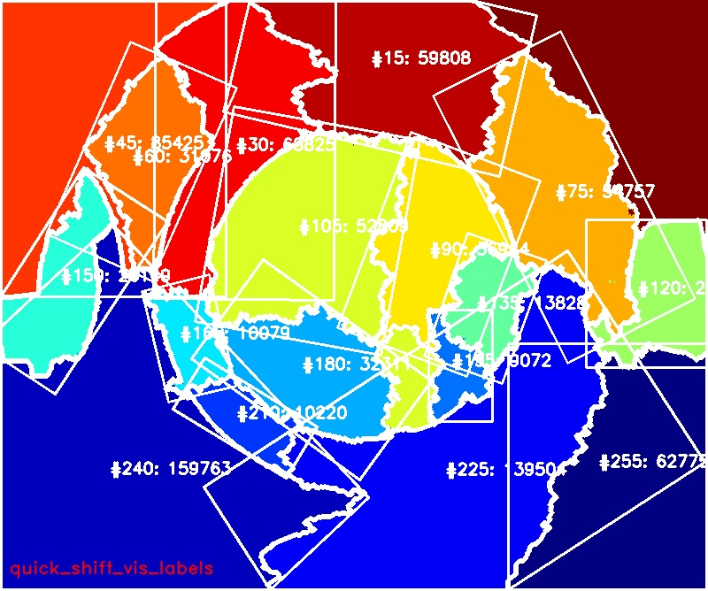

# Quick shift

## Description

From scikit-image: Quick shift segments image using quickshift clustering in Color-(x,y) space.
**Real time**: False

## Usage

- **Clustering**: Clustering tools
- **Visualization**: Visualization tools

## Parameters

- Color space (color_space): no clue (default: HSV)
- Width of Gaussian kernel (kernel_size): (default: 3)
- Max distance (max_dist): Cut-off point for data distances.
  Higher means fewer clusters (default: 6)
- Ratio (ratio): Balances color-space proximity and image-space proximity.
  Higher values give more weight to color-space. (default: 50)

## Example

### Source



### Parameters/Code

Default values are not needed when calling function

```python
from ipapi.ipt import call_ipt

labels = call_ipt(
    ipt_id="IptQuickShift",
    source="arabido_small.jpg",
    return_type="result",
    kernel_size=21,
    max_dist=51,
    ratio=8
)
```

### Result


