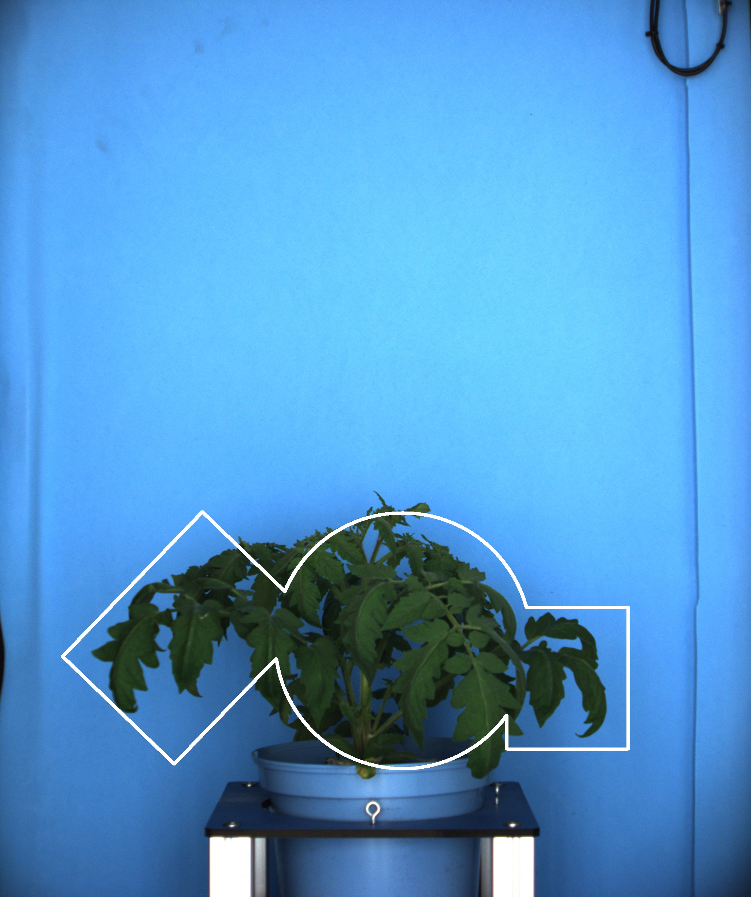

# ROI composition

## Description

Create an ROI by composing other ROIs
**Real time**: True

## Usage

- **Create an ROI**: Create an ROI

## Parameters

- Activate tool (enabled): Toggle whether or not tool is active (default: 1)
- Name of ROI to be used (roi_names): Operation will only be applied inside of ROI (default: )
- ROI selection mode (roi_selection_mode):  (default: all_linked)
- Composition method (op):  (default: intersection)

## Example

### Parameters/Code

Default values are not needed when calling function

```python
from ipapi.base.ipt_functional import call_ipt

None = call_ipt(
    ipt_id="IptRoiComposition",
    source="(TomatoSamplePlant)--(2019-07-04 10_00_00)--(TomatoSampleExperiment)--(vis-side0).jpg",
    return_type="result",
    roi_names='circle_roi,rect_roi,rrect_roi',
    roi_selection_mode='all_named',
    op='union'
)
```

### Result


