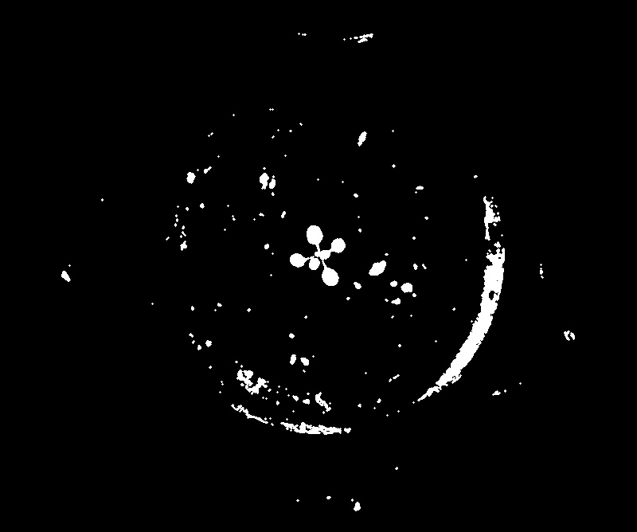

# Range threshold

## Description

Performs range threshold keeping only pixels with values between min and max.  
  
        Morphology operation can be performed afterwards
**Real time**: True

## Usage

- **Threshold**: Creates a mask that keeps only parts of the image

## Parameters

- Activate tool (enabled): Toggle whether or not tool is active (default: 1)
- Channel (channel):  (default: h)
- Invert mask (invert):  (default: 0)
- Threshold min value (min_t):  (default: 0)
- Threshold max value (max_t):  (default: 255)
- Median filter size (odd values only) (median_filter_size):  (default: 0)
- Morphology operator (morph_op):  (default: none)
- Kernel size (kernel_size):  (default: 3)
- Kernel shape (kernel_shape):  (default: ellipse)
- Iterations (proc_times):  (default: 1)
- Overlay text on top of images (text_overlay): Draw description text on top of images (default: 0)
- Build mosaic (build_mosaic): If true edges and result will be displayed side by side (default: 0)
- Background color (background_color): Color to be used when printing masked image.

             if "None" is selected standard mask will be printed. (default: none)

## Example

### Source


### Parameters/Code

Default values are not needed when calling function

```python
from ip_tools import call_ipt

mask = call_ipt(
    ipt_id="IptThreshold",
    source="arabido_small.jpg",
    return_type="result",
    channel='b',
    min_t=140,
    morph_op='open'
)
```

### Result


