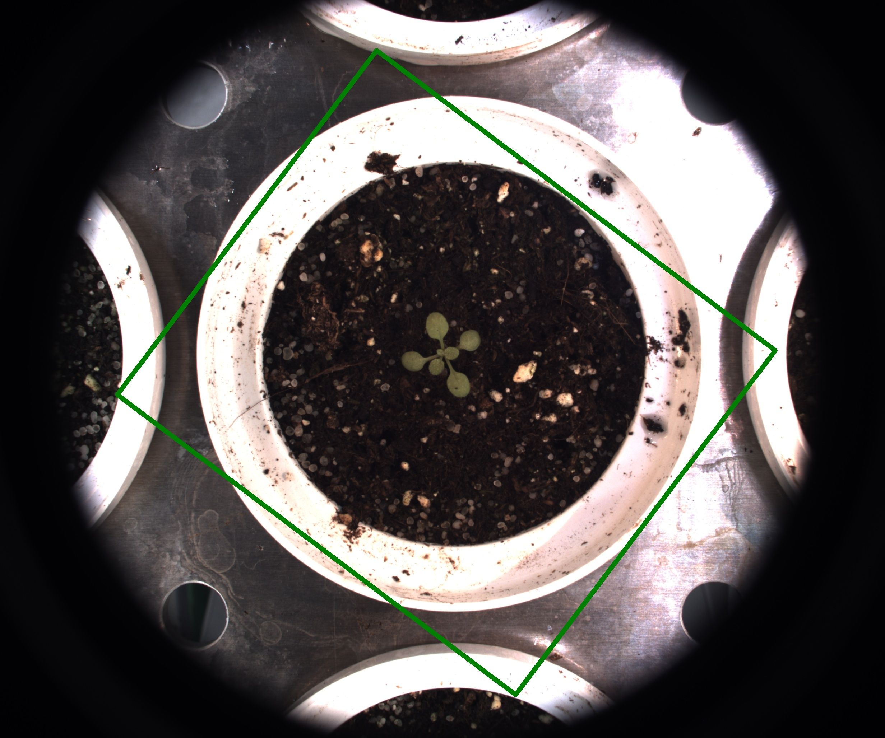

# Rotated rectangle ROI

## Description

Create rotated rectangle ROIs
**Real time**: True

## Usage

- **Create an ROI**: Create an ROI

## Parameters

- ROI name (roi_name):  (default: unnamed_roi)
- Select action linked to ROI (roi_type): no clue (default: keep)
- Target IPT (tool_target): no clue (default: none)
- Left (left):  (default: 0)
- Width (width):  (default: 0)
- Top (top):  (default: 0)
- Height (height):  (default: 0)
- Angle (degres) (angle): Rotation angle of the rectangle (default: 0)
- Apply to images that match (apply_case): List of key values pairs separated by |, to use list as value separate with ',' (default: )
- Launch ROI draw form (draw_roi): Launch OpenCV window to select a ROI (default: 0)

## Example

### Source


### Parameters/Code

Default values are not needed when calling function

```python
from ipapi.base.ipt_functional import call_ipt

call_ipt(
    ipt_id="IptRotatedRectangleRoi",
    source="(arabido_13_g3_t1)--(2019-07-04 11_30_01)--(ArabidopsisSampleExperiment)--(vis-side0).jpg",
    return_type="result",
    left=548,
    width=1389,
    top=437,
    height=1201,
    angle=37
)
```

### Result


