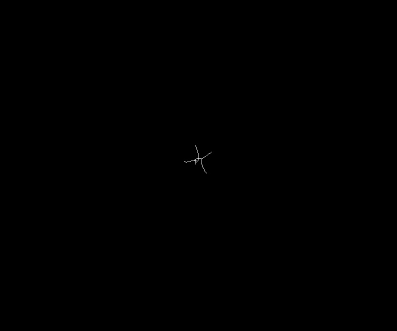

# Skeletonize

## Description

Skeletonize: Thins the input mask to one pixel width lines.<br>Input needs to be a binary mask.<br>**Real time**: False

## Usage

- **Visualization**: Visualization tools
- **Mask cleanup**: Cleans a coarse mask generated by threshold tools

## Parameters

- Skeletonize mode (mode): Select skeletonize method among 4 available (default: skeletonize)
- Color map for medial axis skeletonization (color_map): (default: k_10)
- Build mosaic (build_mosaic): If true source and result will be displayed side by side (default: 0)
- Overlay text on top of images (text_overlay): Draw description text on top of images (default: 1)

## Example

### Source


### Parameters/Code

Default values are not needed when calling function

```python
from ipapi.ipt import call_ipt

mask = call_ipt(ipt_id="IptSkeletonize",
                source="arabido_sample_plant.jpg",
                )
```

### Result


