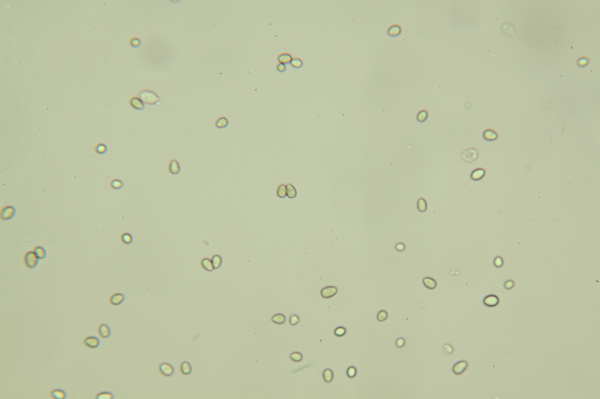

# Split overlapped ellipses

## Description

Split overlapped ellipses.  
        Three methods are available: Concave points detection, Hough circle detection and extrapolation from median area.
**Real time**: True

## Usage

- **Feature extraction**: Tools to extract features from a segmented image

## Parameters

- Activate tool (enabled): Toggle whether or not tool is active (default: 1)
- Use concave detection method (concave):  (default: 1)
- Use Hough detection method (hough):  (default: 1)
- Use median area detection method (median):  (default: 1)
- Approximation factor (approx_factor):  (default: 100)
- Debug font scale (dbg_font_scale):  (default: 2)
- Debug font thickness (dbg_font_thickness):  (default: 4)
- Split object if size is over (min_size_to_split):  (default: 0)
- Residue size (residue_size): Consider all object below this size as noise when analysing objects (default: 10)
- Minimal radius to consider (min_radius): All circles smaller than this will be ignored (default: 400)
- Maximal radius to consider (max_radius): All circles bigger than this will be ignored (default: 1000)
- Minimum distance between two circles (min_distance): Remove circles that are too close (default: 20)
- Radius granularity (step_radius): Steps for scanning radius (default: 10)

## Example

### Source



### Parameters/Code

Default values are not needed when calling function

```python
from ipso_phen.ipapi.base.ipt_functional import call_ipt

call_ipt(
    ipt_id="IptSplitOverlappedEllipses",
    source="IMG_0306.jpg",
    return_type="result"
)
```

### Result image


### Result data

|         key         |        Value        |
|:-------------------:|:-------------------:|
|ellipses_concave_method|46|
|ellipses_median_method|31|
