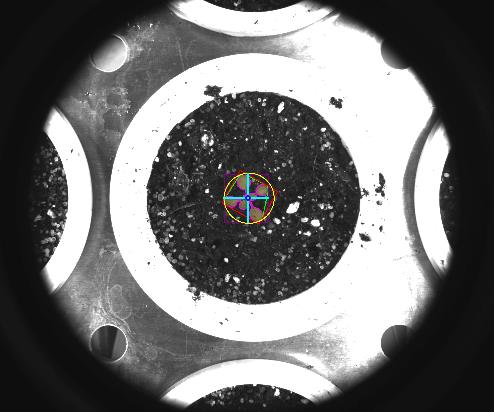

# Visualization helper

## Description

'With the current image and a mask build a visualization for selected features
**Real time**: True

## Usage

- **Image generator**: Creates one or more images from a selected image

## Parameters

- Activate tool (enabled): Toggle whether or not tool is active (default: 1)
- Save generated image (save_image):  (default: 0)
- Name in csv (img_name):  (default: img)
- Image output format (output_format):  (default: source)
- Output naming convention (output_name):  (default: as_source)
- Prefix or suffix (prefix_suffix):  (default: )
- Pseudo color channel (channel):  (default: l)
- Select pseudo color map (color_map):  (default: c_2)
- Foreground (foreground):  (default: source)
- Background color (fore_color):  (default: black)
- Background (background):  (default: bw)
- Background color (bcg_color):  (default: black)
- Background intensity (bck_grd_luma):  (default: 150)
- Normalize source image (normalize):  (default: 0)
- Name of ROI to be used (roi_names): Operation will only be applied inside of ROI (default: )
- ROI selection mode (roi_selection_mode):  (default: all_linked)
- Contour thickness (contour_thickness):  (default: 4)
- Add numeric value for contour (cnt_num):  (default: 0)
- Hull thickness (hull_thickness):  (default: 0)
- Bounding rectangle thickness (bounding_rec_thickness):  (default: 0)
- Straight bounding rectangle thickness (straight_bounding_rec_thickness):  (default: 0)
- Enclosing circle thickness (enclosing_circle_thickness):  (default: 0)
- Centroid width (centroid_width):  (default: 0)
- Centroid line width (centroid_line_width):  (default: 0)
- Add numeric value for centroid x value (cx_num):  (default: 0)
- Add numeric value for centroid y value (cy_num):  (default: 0)
- Height thickness (height_thickness):  (default: 0)
- Width thickness (width_thickness):  (default: 0)

## Example

### Source


### Parameters/Code

Default values are not needed when calling function

```python
from ipapi.base.ipt_functional import call_ipt

image = call_ipt(
    ipt_id="IptDataViz",
    source="(arabido_13_g3_t1)--(2019-07-04 11_30_01)--(ArabidopsisSampleExperiment)--(vis-side0).jpg",
    return_type="result",
    hull_thickness=4,
    bounding_rec_thickness=4,
    straight_bounding_rec_thickness=4,
    enclosing_circle_thickness=4,
    centroid_width=10,
    centroid_line_width=4,
    height_thickness=10,
    width_thickness=10
)
```

### Result image



### Result data

|  key  | Value |
| :---: | :---: |
