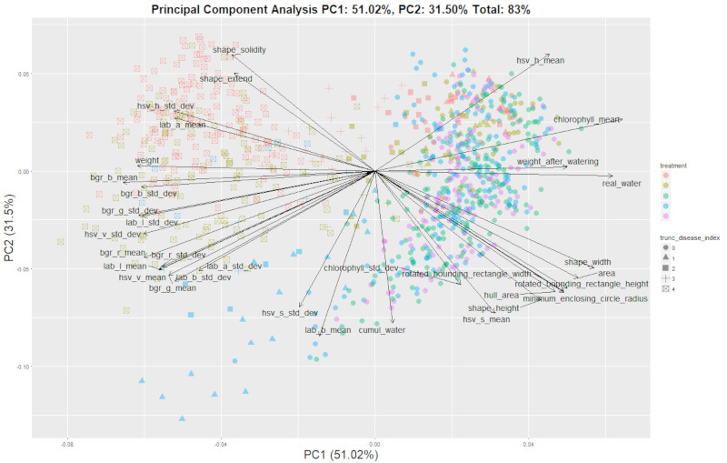
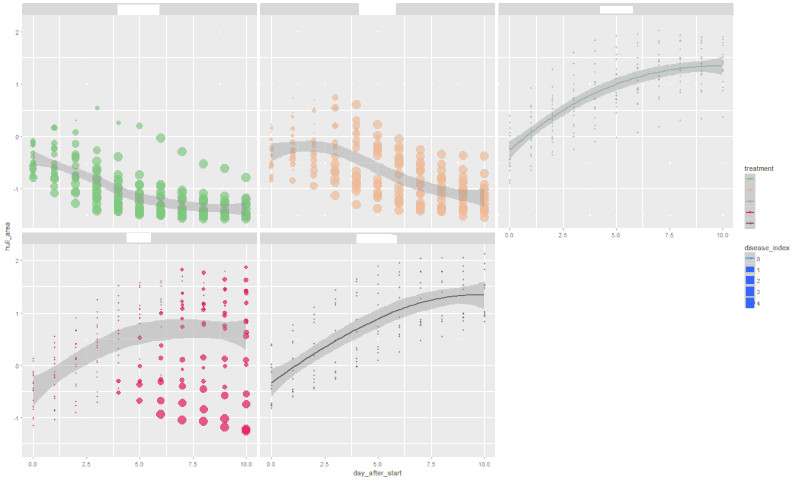
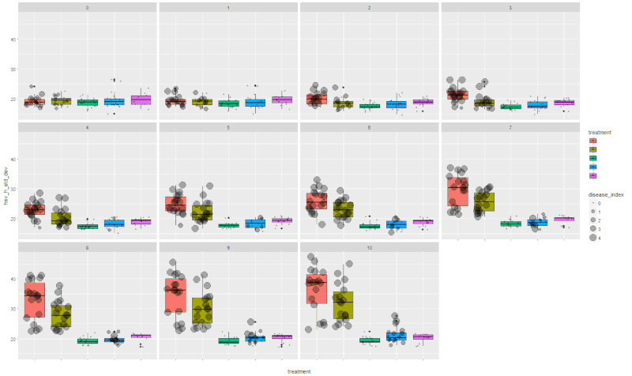
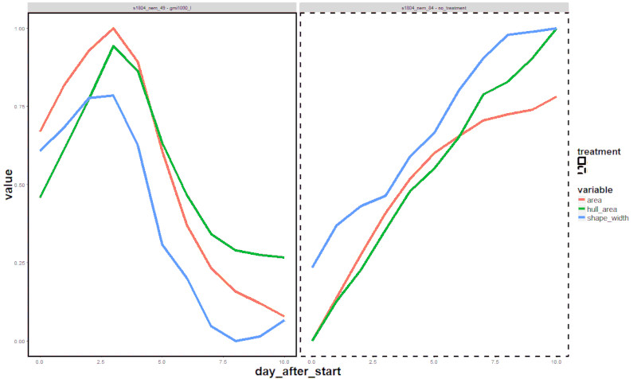

# Pipeline processor

Once we have a valid pipeline it is time to analyse all the images in the experiment. It's time to go to the pipeline processor, which will produce a CSV file with all the extracted features.

## The widgets

### Pipeline selection

Two choices are available

- **Default process**: For each image process will try to find a [class pipeline](class_pipelines.md) able to handle it. Only works if such a class pipeline exists, process will fail otherwise.
- **Pipeline**: Current active pipeline, if none is present the user will be prompted to load one.

### Output file

- **Output folder**: Select the folder where the CSV file and temporary files will be written. IPSO Phen will never delete by itself files in this folder, but it may overwrite them if requested.
- **CSV file name**: as title suggests
- **Overwrite existing files?**: If checked existing partial results will be overwritten.
- **Append experience name to output folder**: If checked a sub folder with experiment name will be created, checking this option is good idea (trust me on this one).
- **Append timestamp to output folder**: Creates a new folder each time each time the processor is launched, good if you want to compare pipelines performance, or want to keep track of things (which you should).

### Series Id

In some cases we need to tag groups of images as belonging to one group, for example photos of each plant are taken with multiple angles in a short lapse of time. If checked, this setting tags all the images of a certain plant taken within a selected time as belonging to the same series.

### Thread count

IPSO Phen can run the analysis using multiple threads, this speeds up the process but requires much more RAM, use at your own risk.  
By default the number of threads is limited to the number of cores.  
Thread count can be modified during the execution of the process.

## How does it work

Once the start button is pressed the program will analyse all the images. Each image analysis will generate a CSV file and all the files will be merged when the process ends. Individual CSV files are generated so that we can resume the analysis if we have to stop for any reason.

## And then?

Once we have a nice CSV containing all the image analysis traits data, we can use some visualization apps to begin to understand the data that we've gathered.

> We will release the visualization apps later this year
