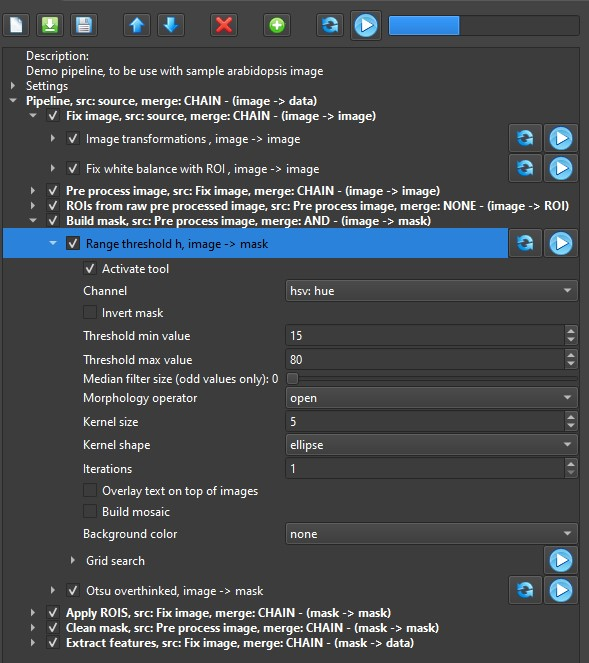

# Pipelines

Pipelines are sets of image processing tools and groups chained together in order to extract features from an image. Follows a description of the pipeline UI

## Tool bar

The toolbar has buttons to help configure and run the pipeline, they are from left to right:

- **New**: Start a new pipeline from scratch, all current settings will be lost.
- **Load**: Load a previously saved pipeline.
- **Save**: Save current pipeline.
- **Move up**: Move selected tool/group up.
- **Move down**: Move selected tool/group down.
- **Delete**: Delete current tool/group.
- **Add**: Add a tool or a group to the selected group from a drop down menu. Tools are separated by function. At the bottom of the list some pre-filled groups are available.
- **Invalidate cache**: Clear pipeline's cache, more that [here](Executing a pipeline).
- **Run**: Runs current pipeline on selected image.

## Pipeline tree

The pipeline UI is composed of three main nodes

### Description

The description can be set at any time. It should tell what the pipeline does and to which experiment/species it targets.

### Settings

The pipeline settings describe the pipeline's behavior:

- **Image output folder**: Path to which the images generated by the pipeline will be saved. Those are not the debug or display images, but those explicitly saved. This setting is always overridden when running the pipeline with the pipeline processor.
- **Display debug images**: If checked all step images generated biy the tools will be displayed.
- **Allow mosaic for steps**: If checked, tools that generate more than one image will output mosaics for display needs.
- **Stop processing on error level**: Stop pipeline processing when an error of this level or higher happens.
- **Enable mosaic**: If checked, a mosaic image will be displayed at the end of the process.
- **Mosaic settings**: Use the speed buttons to select the number of columns and rows in the mosaic. Double-click on each cell and use the drop down menu to select an image by name.

### Actual pipeline

Two types of items can be added to a pipeline, groups and tools. Groups are place holders for tools and can also be nested if needed. Tools are the image processing widgets that do all the hard work.

#### Groups

Groups are always displayed with a bold font (note that the pipeline root is a group itself). Each group is described by the text line as follows:

- **Name**: Editable.Either generated automatically or edited by the user.
- **Source**: Editable. By default set to the previous group, can be set to any group that is executed before. Source is used for the base image not the mask. If the selected source is missing a cascade fallback is implemented and a warning will be raised.
- **Merge**: Editable. 4 merge modes are available:
  - **CHAIN**: The output of the previous tool/group will be used as the input for the current tool/group.
  - **AND**: All tools/groups will be processed and the output will be generated from a logical AND.
  - **OR**: All tools/groups will be processed and the output will be generated from a logical OR.
  - **NONE**: Tools/groups will be handle independently.
- **input->output**: Not editable. Displays the types of the input and the output, depends on the tools/groups inside the group

Double-click on a group to toggle edit mode  

#### Tools

The following families of tools can be added to pipelines:

!!! note
    Some tools may be present in more than one category.

- **Assert...**: Ensure that something is true like [Check source image](ipt_Check_source_image.md) which ensures that the selected image is available and can be read.
- **Create an ROI**: Create an ROI either dynamically [Hough circle detector](ipt_Hough_circles_detector.md) or statically [Annulus ROI](ipt_Annulus_ROI.md)
- **Exposure fixing**: Fix the image exposure either for exemple by reaching a target exposure like [image transformation](ipt_Image_transformations.md).
- **White balance**: Fix image white balance with the help of an ROI like [Fix white balance with ROI](ipt_Fix_white_balance_with_ROI.md) or without like [Simple white balance](ipt_Simple_white_balance.md)
- **Pre-processing**: Transform the image to help creating a mask with threshold tools. Contrary to the previous families, this one can considerably alter the image, this why this tools should never be set as source for groups that extract color data. These family contains tools such as [Check exposure](ipt_Check_exposure.md) which will change the color of all parts of the image that are over/under exposed and [Contrast Limited Adaptive Histogram Equalization](ipt_CLAHE.md)
- **Threshold**: Creates a mask where only portions af the image appear. This family contains tools as simple to use as [Triangle threshold](ipt_Triangle_threshold.md) or as complex as [Otsu overthinked](ipt_Otsu_overthinked.md)
- **Mask cleanup**: Despite your best efforts, some times masks contain some noise, this family is here to help on those cases, the simplest of this tools is [Morphology](ipt_Morphology.md), a more complex approach would use [Keep linked contours](ipt_Keep_linked_Contours.md)
- **Feature extraction**: Normally near the end of a pipeline, this family of tools extract data from the image, most of the time this tools need a mask in order to work. Some examples are [Analyse object](ipt_Analyze_object.md) and [Analyse bound](ipt_Analyze_bound.md)
- **Image generator**: At any moment the user can insert a tool from this family to save any image generated by other tools.

It is recommended to put tools of the different families in different groups.

Some tools react in real time when their parameters are changed, others wait for the user the run the pipeline.

Each tool has a grid search option nested within, more on that [here](grid_search.md)

## Loading and saving pipelines

Pipelines can be saved and loaded at any time. We've chosen JSON as our serialization format so the files are human readable.

## Executing the pipeline

A pipeline can be executed in four different ways. Whichever is used all steps processed will be stored so if the same pipeline is executed again, only the the steps that have changed and those which depend on them will be executed.

### Normal execution

Launch the pipeline from the tool bar, the pipeline is fully applied to the selected image.

### Single tool execution

Each tool has a reset and play button linked to it. The reset button sets all tool parameters to their default step. The "play" button runs the pipeline until it reaches the selected tools and then stops and outputs the result. If the tools reacts in real time (like most threshold tools), changing a parameter will have the same effect as pushing the play button and with the help of the cache system it will be quick.

### Batch process

Below the the pipeline lies the batch processor.  
  
It processes a set amount of images from the image browser with different behaviors:

- **All**: All images in the browser will be processed.
- **First n**: The first n images in the browser will be processed.
- **Random n**: A random subset of n images from the browser will be processed.

Whichever mode is selected, only one illustration image per source image will be displayed, either the last one or the mosaic if it's enabled.

### Grid search

See [Grid search manual page](grid_search.md) for more information on the specifics.  
Same as with "Single tool execution" the pipeline will be executed until it reaches the selected tool, but then the grid search will be executed instead of the tool itself.
