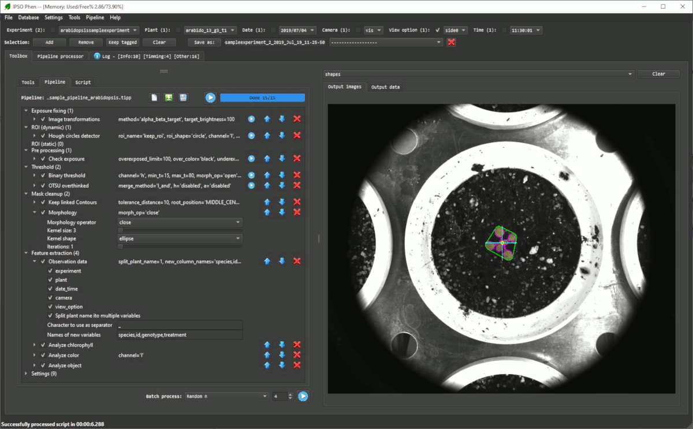
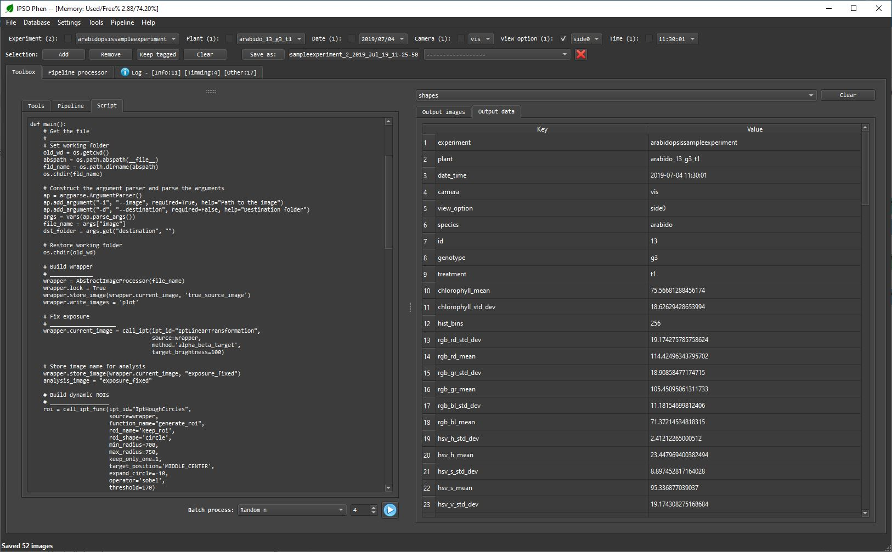
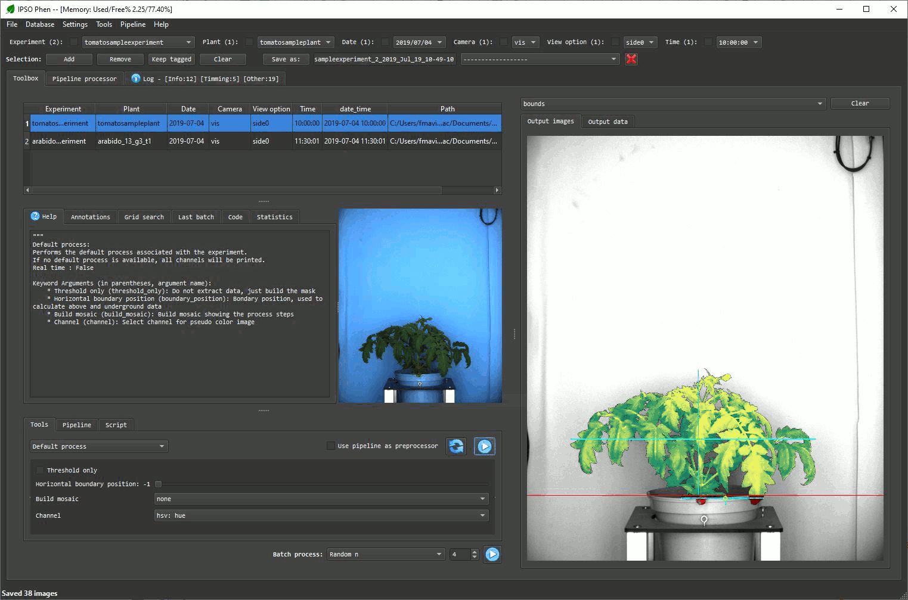

# Samples

Two sample images (locate in the sample_images folder) are available.
To load this files into IPSO Phen go to File/Parse folder and select the sample_images folder

## Arabidopsis top view
This example illustrates how a standard pipeline and generated scripts work.
To use this sample:
1. Select the *arabidopsis* image from the sample images
2. Load the sample pipeline from the sample_pipelines folder from "Pipeline/Load..."
3. Select the "Pipeline" tab next to the "Tools" tab
4. Run the pipeline

- Sample pipeline and output image
  
- Generated script (excerpt) and output data 
  

The generated script can be called as a stand alone Python script, it can also be edited to achieve results others than the ones available with the default pipeline structure

## Tomato side view
This example shows how a class pipeline works, to execute it just select the "Default process" tool from the "Tools/Execute default process" menu after selection the tomato plant sample. Once this is done, the step by step images will appear on the "output images" panel and the features extracted will appear on the "output data" panel.

- Output images: 
 