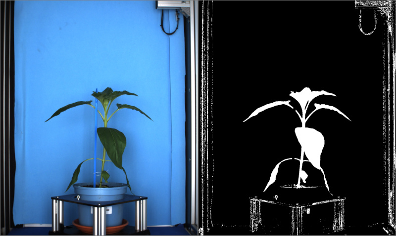
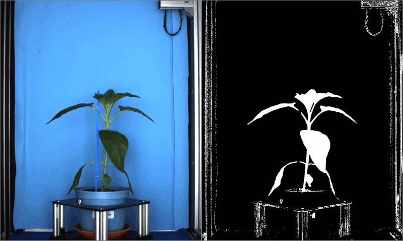
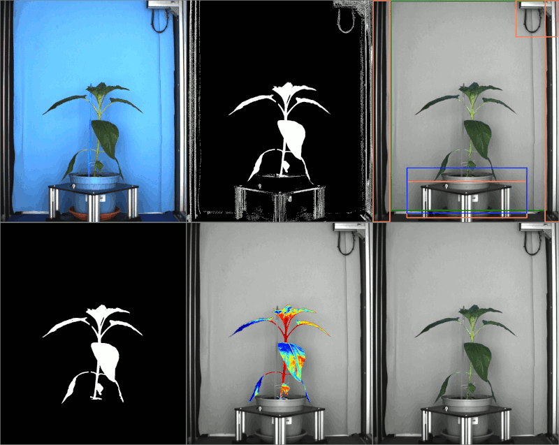

# Testing

Tests target the images in the image browser, they behave in three different ways:

- **All**: All images in the browser will be tested regardless of the number displayed on the spin box.
- **First n**: The first "n" images will be processed, "n" refers to the number in the spin box.
- **Random n**: A random set of "n" images is picked from the image browser for the test to be run, "n" refers to the number in the spin box.

## Testing a binary threshold on a random set of images from the browser

Lets say that we are building a [pipeline](pipelines.md) and after adding the steps for pre-processing, we find some binary threshold values that work on a given image.
 

!!! question
    Wait a minute, this does not work, there's plenty of the background still on the mask! Says the attentive reader. And I agree with you, but keep in mind that this is just the first of many steps to build the mask, for an in depth tutorial on how to build pipelines check [this](pipelines.md).

 How to check if these parameters work for the other images on the experiment, well thanks to the testing feature   we can check any amount of images that we want with one click. And as we see on the result below we still have work to do as it appears that brown leaves are missed by this threshold.

## Testing a pipeline on a random set of images from the browser

But testing is not limited to single tools, it can be done on a full pipeline as seen below.

