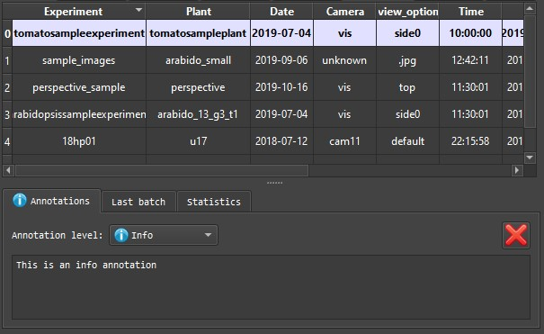
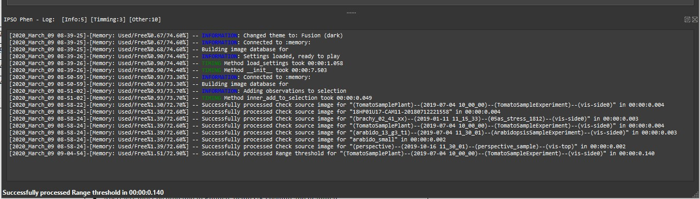

# User interface (UI)

## Adding images to the browser

Since IPSO Phen is high throughput oriented it parses full folders instead of loading single files.

!!! warning
    Parsing is recursive, ie images in all sub folders will be added to the catalog.

Add files to the browser via the "file/parse folder" menu, the form below should appear.

### Adding files to non persistent database

This is the default behavior, this mode builds a memory database that is destroyed when the program is closed. On restart the program will rebuild the database.  
Previous parsed folders are stored in the *Recent folders* sub menu.

### Adding files to persistent databases

To create a persistent database select 'sqlite' as DBMS in the previous form, the option to edit the name will be enabled.  
Persistent databases are stored in the *sqlite_databases* folder. If you no longer need a database, delete the file associated to it in the folder and the program will remove it.  
To establish a connection to an already existing database, select it from the *Databases* sub menu in the file menu.

## File manager

### First row

The first row lets the user select images with the help of combo boxes filed with information from the images in the folder.There are two extraction modes available when analyzing file names:

- EXPERIMENT;PLANTNAME;CAMERA-VIEWOPTION;YYYY,MM,DD-HHhMMmSSs;NUMBER
- (PLANTNAME)--(YYYY-MM-DD HH_MM_SS)--(EXPERIMENT)--(CAMERA-VIEWOPTION)

If the name of the file does not follow any of these schemes, the fields will be set as follows:

- **EXPERIMENT**: Folder name
- **PLANTNAME**: File name without extension
- **CAMERA**: Unknown
- **VIEWOPTION**: File extension
- **DATETIME**: From file system

### Second row

The second row handles insertion and deletion of images in the [file browser](#file-browser) as follows

- **Add**: Adds images to the file browser according to first row's combo boxes check states, if checked only images with the same value will be added to the browser.
- **Remove**: Same as **add** but removing images.
- **Keep tagged**: Removes all images that have no [annotation](#annotations) linked to them.
- **Clear**: Removes all images from browser
- **Save as**: Saves the current browser state to be restored at a later time through the combo box to the right

## Toolbox

Main part of the program. Used to build pipelines with the tools available.

### File browser

Holds a list of images. Only the images in the browser will be considered when launching [tests](#tests) or executing the [pipeline processor](#pipeline-processor). Colors correspond to [annotation](#annotations) kinds.

### Middle tabs

#### Help

Help for the currently selected tool

#### Annotations

If activated in the menu, each image can have an annotation attached to it. Each annotation is comprised of a level, which can go be:

- "Info"
- "OK"
- "Warning"
- "Error
- "Critical"
- "Source issue"
- "Unknown"

The levels meaning is purely visual, each level is represented on the UI with a different colour, the user can use them as she sees fit.

#### Grid search

The [grid search](grid_search.md) feature allows the exploration of a whole solution space defined by a customized range for each setting. It is an easy way to check a large amount of settings with just one click. The results  can be reviewed on the user interface or be converted into a video.

#### Last Batch

[Tests](#tests) can be launched on a set of images, this set can be random, in order to be able to reproduce the same test you can save the images used for the test to be repeated later.

#### Code

Every time a [tool](#tools) is edited the code needed to reproduce its current behavior in a script is updated in this tab.

#### Statistics

Statistics on the images in the file browser.

### Source image

Displays the currently selected image.

### Tools

The combo box allows tool selection.  
The check box "use pipeline as preprocessor" executes the preprocessing part of the active pipeline before running the selected tool.  
The rest of the tab corresponds to the tool's user interface, each tool generates its own UI.

### Pipeline

Pipelines are created by adding tools together, more on that [here](pipelines.md).  
Pipelines can be saved on three different ways:

- As a binary file - the default method.
- As human readable json file, the main purpose of this format is to be able to reproduce a pipeline in case the binary format changes in the future. I will try as hard as I can to never break backwards compatibility but I can not guaranty it.
- As a Python script, see below.

### Script

Every time a change is made to the pipeline the [Python script](pipelines.md) is updated. Once saved it can be run as a command line.

### Output

Displays the result from the tool as an image and as data if the tool also generates it.

### Tests

One of the main features of IPSO Phen is the possibility to run tests.  
Tests can be run on individual tools or full pipelines.  
More on testing [in its own section](testing.md)

## Pipeline processor

Once a pipeline has been built and tested on a large enough amount of images, we can run it on all the images of the experiment. Afterwards a CSV with all the raw data is created.

## Log

Lots of boring information which nobody cares about unless something goes wrong.
