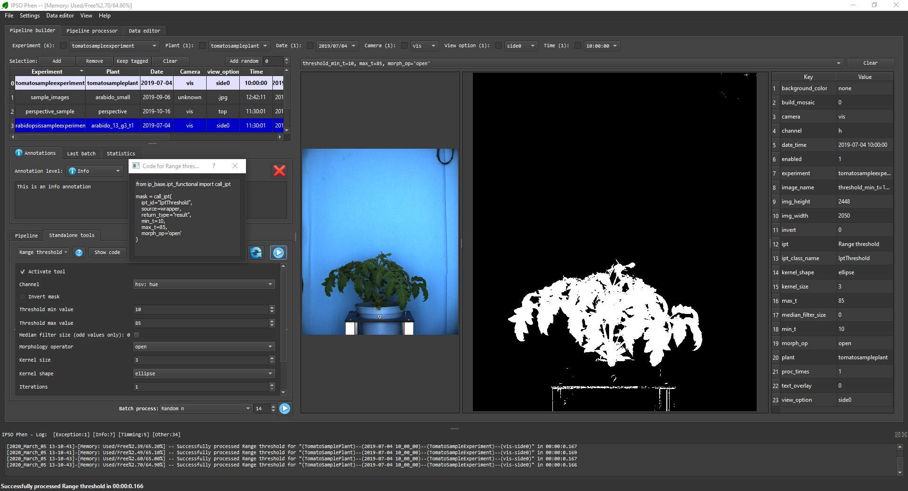

# User interface (UI)

## Adding images to the browser

Since IPSO Phen is high throughput oriented it parses full folders instead of loading single files.

!!! warning
Parsing is recursive, ie images in all sub folders will be added to the catalog.

Add files to the browser via the "file/parse folder" menu, the form below should appear.

### Adding files to non persistent database

This is the default behavior, this mode builds a memory database that is destroyed when the program is closed. On restart the program will rebuild the database.  
Previous parsed folders are stored in the _Recent folders_ sub menu.

### Adding files to persistent databases

To create a persistent database select 'sqlite' as DBMS in the previous form, the option to edit the name will be enabled.  
Persistent databases are stored in the _sqlite_databases_ folder. If you no longer need a database, delete the file associated to it in the folder and the program will remove it.  
To establish a connection to an already existing database, select it from the _Databases_ sub menu in the file menu.

## Pipeline builder

### File selector

Use the combo boxes to select an image from the current database. The check boxes are used when adding images to the image browser.  
Two filename patterns are recognized:

- EXPERIMENT;PLANTNAME;CAMERA-VIEWOPTION;YYYY,MM,DD-HHhMMmSSs;NUMBER
- (PLANTNAME)--(YYYY-MM-DD HH_MM_SS)--(EXPERIMENT)--(CAMERA-VIEWOPTION)

If the name of the file does not follow any of these schemes, the fields will be set as follows:

- **EXPERIMENT**: Folder name
- **PLANTNAME**: File name without extension
- **CAMERA**: Unknown
- **VIEWOPTION**: File extension
- **DATETIME**: From file system

### Image browser

Holds a list of images. Only the images in the browser will be considered when launching [tests](#tests) or executing the [pipeline processor](#pipeline-processor). Colors correspond to [annotation](#annotations) kinds.  
Images are added or removed from the browser with the first row buttons as follows:

- **Add**: Adds images to the file browser according to first row's combo boxes check states, if checked only images with the same value will be added to the browser.
- **Remove**: Same as **add** but removing images.
- **Keep tagged**: Removes all images that have no [annotation](#annotations) linked to them.
- **Clear**: Removes all images from browser.
- **Add random**: Adds a random subsets of the images.

### Annotations

If activated in the menu, each image can have an annotation attached to it. Each annotation is comprised of a level, which can go be:

- "Info"
- "OK"
- "Warning"
- "Error
- "Critical"
- "Source issue"
- "Unknown"

The levels meaning is purely visual, each level is represented on the UI with a different colour, the user can use them as she sees fit.

### Last Batch

Stores the images selected for the last test batch. More on testing [in its own section](testing.md)

### Statistics

Statistics on the images in the file browser.

### Source image

Displays the currently selected image.

### Standalone tools

- The combo box allows tool selection.
- _Question mark_ displays tool's help.
- _Show code_ displays the code to be used in a script to have the same effect.
- The rest of the tab corresponds to the tool's user interface, each tool generates its own UI.

### Pipeline

Pipelines are created by adding tools together, more on that [here](pipelines.md).

### Output

Displays the result from the tool as an image and as data if the tool also generates it.

### Tests

One of the main features of IPSO Phen is the possibility to run tests.  
Tests can be run on individual tools or full pipelines.  
More on testing [in its own section](testing.md)

## Pipeline processor

Once a pipeline has been built and tested on a large enough amount of images, we can run it on all the images of the experiment. Afterwards a CSV with all the raw data is created.

## Log

Lots of boring information which nobody cares about unless something goes wrong.  
It is a docked window so it can be snapped everywhere on the UI or detached from it.
