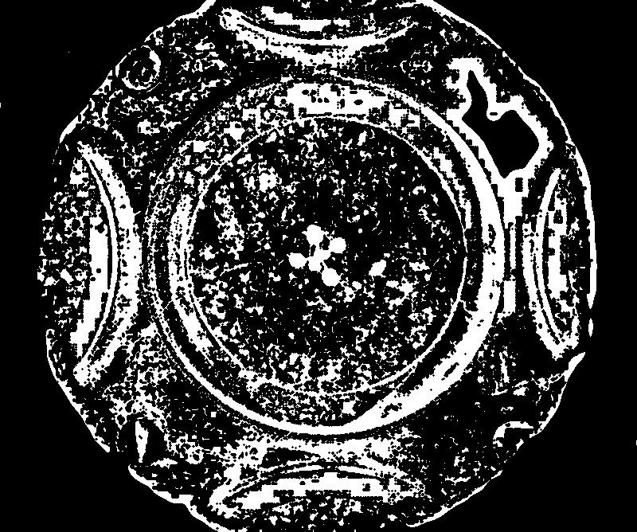

# Adaptive threshold

## Description

Perform a adaptive threshold.  
Morphology operation can be performed afterwards.  

**Real time**: True

## Usage

- **Threshold**: Creates a mask that keeps only parts of the image

## Parameters

- Activate tool (enabled): Toggle whether or not tool is active (default: 1)
- Select source file type (source_file): no clue (default: source)
- Channel (channel): (default: h)
- Invert mask (invert_mask): Invert result (default: 0)
- Max value (max_value): Non-zero value assigned to the pixels for which the condition is satisfied (default: 255)
- Adaptive method (method): Adaptive thresholding algorithm to use, see cv::AdaptiveThresholdTypes (default: gauss)
- Block size (block_size): Size of a pixel neighborhood that is used to calculate a threshold value for the pixel: 3, 5, 7, and so on. (default: 3)
- C (C): Constant subtracted from the mean or weighted mean (see the details below).
  Normally, it is positive but may be zero or negative as well. (default: 2)
- Build mosaic (build_mosaic): If true source and result will be displayed side by side (default: 0)
- Median filter size (odd values only) (median_filter_size): (default: 0)
- Morphology operator (morph_op): (default: none)
- Kernel size (kernel_size): (default: 3)
- Kernel shape (kernel_shape): (default: ellipse)
- Iterations (proc_times): (default: 1)
- Overlay text on top of images (text_overlay): Draw description text on top of images (default: 0)

## Example

### Source


### Parameters/Code

Default values are not needed when calling function

```python
from ipapi.ipt import call_ipt

mask = call_ipt(ipt_id="IptThresholdAdaptive",
                source="arabido_sample_plant.jpg",
                invert_mask=1,
                block_size=43,
                morph_op='erode')
```

### Result


