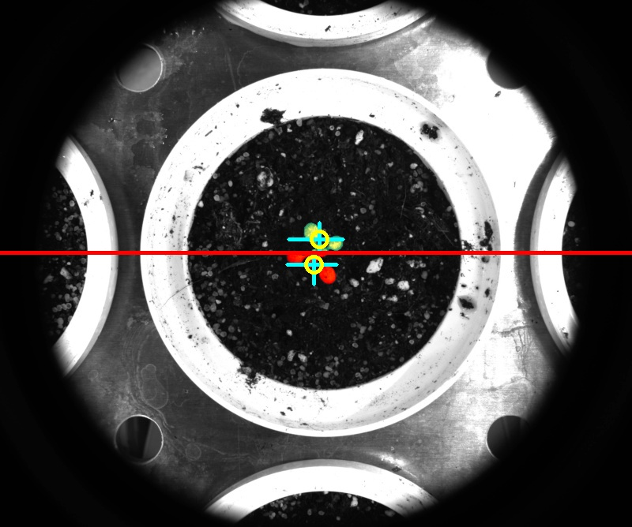

# Analyze bound

## Description

Analyses object bound.<br>
Needs a mask as an input.<br>
Normally used in a pipeline after a clean mask is created.<br>

**Real time**: Does not apply

## Usage

- **Feature extraction**: Tools to extract features from a segmented image

## Parameters

- Height above bound level (above_bound_height): (default: 1)
- Area above bound level (above_bound_area): (default: 1)
- Percentage area above bound level (above_bound_percent_area): (default: 1)
- Height below bound level (below_bound_height): (default: 1)
- Area below bound level (below_bound_area): (default: 1)
- Percentage area below bound level (below_bound_percent_area): (default: 1)
- Horizontal bound position (line_position): Horizontal bound normally used to separate above from below ground (default: -1)
- Channel (channel): (default: l)

---

## Example

### Source


### Parameters/Code

Default values are not needed when calling function

```python
from ipapi.ipt import call_ipt

dictionary = call_ipt(ipt_id="IptAnalyzeBound",
                      source="arabido_sample_plant.jpg",
                      line_position=320)
```

### Result image



### Result data

|           key            |       Value        |
| :----------------------: | :----------------: |
|    above_bound_height    |         38         |
|     above_bound_area     |        857         |
| above_bound_percent_area | 45.804382683057185 |
|    below_bound_height    |         39         |
|     below_bound_area     |        1014        |
| below_bound_percent_area | 54.195617316942815 |
