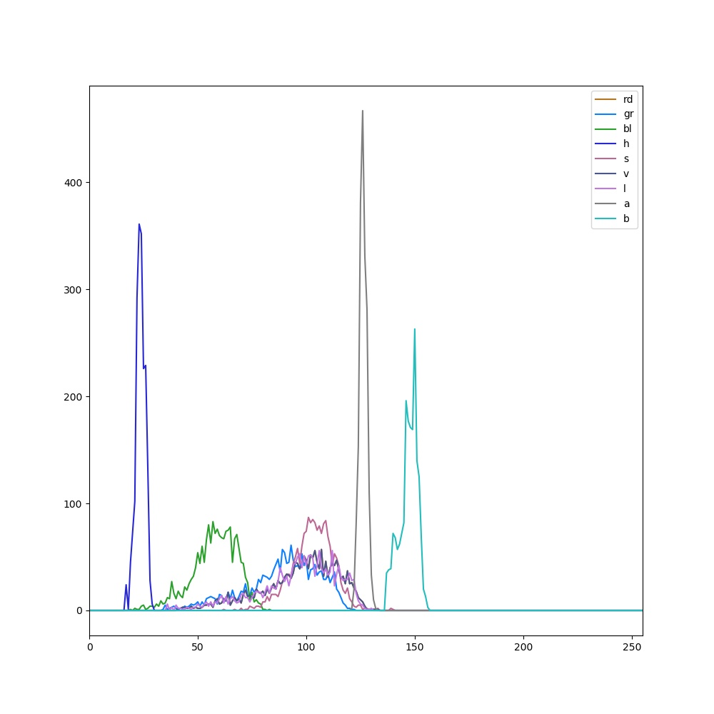

# Analyze color

## Description

Analyses object color.<br>
Needs a mask as an input.<br>
Normally used in a pipeline after a clean mask is created.<br>

**Real time**: Does not apply

## Usage

- **Feature extraction**: Tools to extract features from a segmented image

## Parameters

- Add color mean information (color_mean): (default: 1)
- Add color standard deviation information (color_std_dev): (default: 1)
- Histogram bins (hist_bins): (default: 256)
- Select amount of quantiles for color analysis (quantile_color): (default: 4)
- Channel (channel): (default: l)
- Debug image background (background): (default: bw)
- Select pseudo color map (color_map): (default: c_2)

---

## Example

### Source


### Parameters/Code

Default values are not needed when calling function

```python
from ipapi.ipt import call_ipt

dictionary = call_ipt(ipt_id="IptAnalyzeColor",
                      source="arabido_sample_plant.jpg",
                      )
```

### Result image



### Result data

|                key                |        Value         |
| :-------------------------------: | :------------------: |
|             hist_bins             |         256          |
|          rgb_rd_std_dev           |  17.728421117977845  |
|            rgb_rd_mean            |  97.03634420096205   |
|          rgb_gr_std_dev           |  17.310521108732747  |
|            rgb_gr_mean            |  88.85729556386958   |
|          rgb_bl_std_dev           |  10.40814325180253   |
|            rgb_bl_mean            |  57.77872795296632   |
|           hsv_h_std_dev           |  2.1443035937574995  |
|            hsv_h_mean             |  23.615179048637092  |
|           hsv_s_std_dev           |  9.651248283935816   |
|            hsv_s_mean             |  102.77979690005344  |
|           hsv_v_std_dev           |  17.728421117977845  |
|            hsv_v_mean             |  97.03634420096205   |
|           lab_l_std_dev           |  18.37717073841361   |
|            lab_l_mean             |  96.11117049706039   |
|           lab_a_std_dev           |  1.6835041080798914  |
|            lab_a_mean             |  126.21218599679315  |
|           lab_b_std_dev           |  4.119154624582707   |
|            lab_b_mean             |  147.07642971672902  |
| quantile_color_rgb_rd_1_4_percent |  5.772314220666885   |
| quantile_color_rgb_rd_2_4_percent |  93.96044611930847   |
| quantile_color_rgb_rd_3_4_percent | 0.26723677292466164  |
| quantile_color_rgb_rd_4_4_percent |         0.0          |
| quantile_color_rgb_gr_1_4_percent |  10.048102587461472  |
| quantile_color_rgb_gr_2_4_percent |  89.95189666748047   |
| quantile_color_rgb_gr_3_4_percent |         0.0          |
| quantile_color_rgb_gr_4_4_percent |         0.0          |
| quantile_color_rgb_bl_1_4_percent |  67.87813901901245   |
| quantile_color_rgb_bl_2_4_percent |  32.12186098098755   |
| quantile_color_rgb_bl_3_4_percent |         0.0          |
| quantile_color_rgb_bl_4_4_percent |         0.0          |
| quantile_color_hsv_h_1_4_percent  |        100.0         |
| quantile_color_hsv_h_2_4_percent  |         0.0          |
| quantile_color_hsv_h_3_4_percent  |         0.0          |
| quantile_color_hsv_h_4_4_percent  |         0.0          |
| quantile_color_hsv_s_1_4_percent  | 0.053447356913238764 |
| quantile_color_hsv_s_2_4_percent  |  99.41207766532898   |
| quantile_color_hsv_s_3_4_percent  |  0.5344735458493233  |
| quantile_color_hsv_s_4_4_percent  |         0.0          |
| quantile_color_hsv_v_1_4_percent  |  5.772314220666885   |
| quantile_color_hsv_v_2_4_percent  |  93.96044611930847   |
| quantile_color_hsv_v_3_4_percent  | 0.26723677292466164  |
| quantile_color_hsv_v_4_4_percent  |         0.0          |
| quantile_color_lab_l_1_4_percent  |  7.215392589569092   |
| quantile_color_lab_l_2_4_percent  |  92.57081747055054   |
| quantile_color_lab_l_3_4_percent  | 0.21378942765295506  |
| quantile_color_lab_l_4_4_percent  |         0.0          |
| quantile_color_lab_a_1_4_percent  |         0.0          |
| quantile_color_lab_a_2_4_percent  |  76.69695615768433   |
| quantile_color_lab_a_3_4_percent  |  23.303046822547913  |
| quantile_color_lab_a_4_4_percent  |         0.0          |
| quantile_color_lab_b_1_4_percent  |         0.0          |
| quantile_color_lab_b_2_4_percent  |         0.0          |
| quantile_color_lab_b_3_4_percent  |        100.0         |
| quantile_color_lab_b_4_4_percent  |         0.0          |
