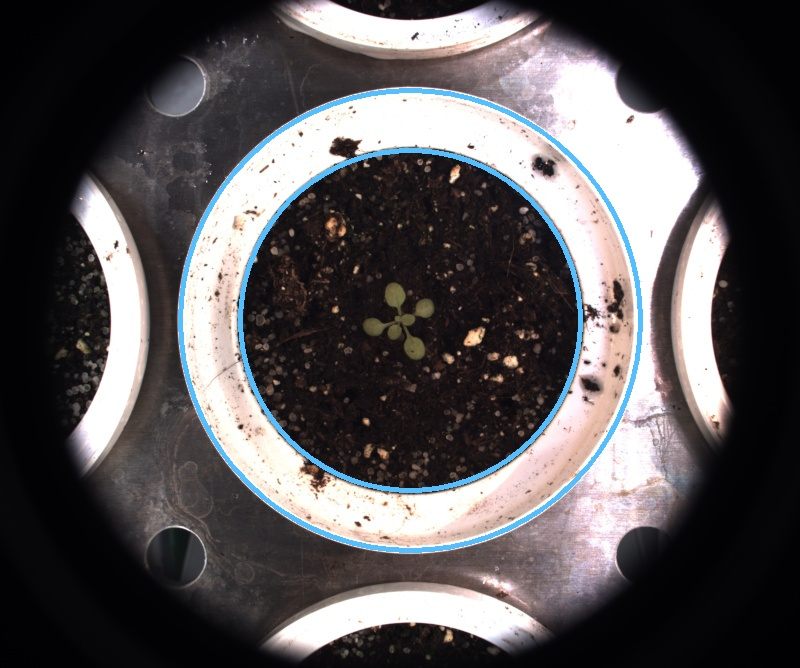

# Annulus ROI

## Description

Creates annulus ROIs
**Real time**: True

## Usage

- **ROI (static)**: Create a ROI from coordinates

## Parameters

- ROI name (roi_name): (default: unnamed_roi)
- Select action linked to ROI (roi_type): no clue (default: keep)
- Target IPT (tool_target): no clue (default: none)
- Center x coordinate (cx): (default: 0)
- Center y coordinate (cy): (default: 0)
- Radius (radius): (default: 0)
- Inside radius (in_radius): (default: 0)
- Launch ROI draw form (draw_roi): Launch OpenCV window to select a ROI (default: 0)

## Example

### Source


### Parameters/Code

Default values are not needed when calling function

```python
from ipapi.ipt import call_ipt

call_ipt(
    ipt_id="IptAnnulusRoi",
    source="arabido_sample_plant.jpg",
    return_type="result",
    roi_type='dilate',
    cx=410,
    cy=320,
    radius=230,
    in_radius=170
)
```

### Result


