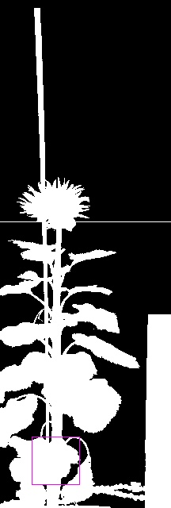

# Assert mask position

## Description

Check that the mask intersects with a named ROI
**Real time**: True

## Usage

- **Assert...**: Assert something, returns wether or not assertion is passed

## Parameters

- Activate tool (enabled): Toggle whether or not tool is active (default: 1)
- Name of ROI to be used (roi_names): Operation will only be applied inside of ROI (default: )
- ROI selection mode (roi_selection_mode): (default: all_linked)

## Example

### Source


### Parameters/Code

Default values are not needed when calling function

```python
from ipapi.base.ipt_functional import call_ipt

None = call_ipt(
    ipt_id="IptAssertMaskPosition",
    source="18HP01U17-CAM11-20180712221558.jpg",
    return_type="result"
)
```

### Result


