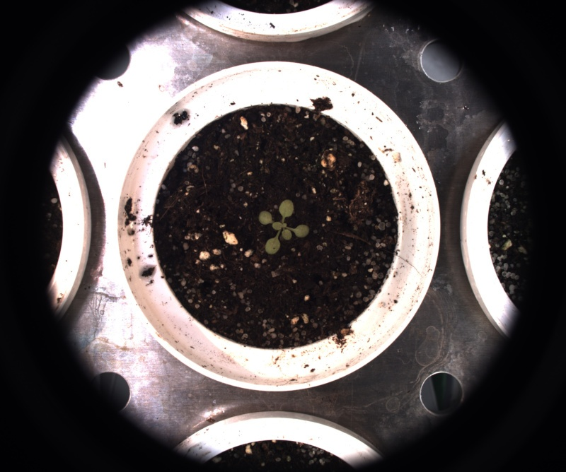

# Augment data

## Description

Copies image to target folder after modifying it  
 Can have a ROI as a pre-processor
**Real time**: False

## Usage

- **Image generator**: Creates one or more images from a selected image

## Parameters

- Target folder (path): Can be overridden at process call (default: )
- Put image in subfolder with experiment as its name (add_sub_folder): (default: 0)
- Image output format (output_format): (default: source)
- Test only, do not actually copy (test_only): (default: 1)
- Source image (original): (default: 1)
- Rotate 90 degres (r90): (default: 0)
- Rotate 180 degres (r180): (default: 0)
- Rotate 270 degres (r270): (default: 0)
- flip horizontally (flip_h): (default: 0)
- flip vertically (flip_v): (default: 0)
- Gamma values (same syntax as grid search) (gamma_values): (default: 1)

## Example

### Source


### Parameters/Code

Default values are not needed when calling function

```python
from ipapi.ipt import call_ipt

call_ipt(
    ipt_id="IptAugmentData",
    source="arabido_sample_plant.jpg",
    return_type="result",
    path='C:\Users\***\Pictures\ipso_phen_data\saved_images\2019_December_24-102459',
    original=0,
    flip_h=1
)
```

### Result image



### Result data

|      key       |                                   Value                                   |
| :------------: | :-----------------------------------------------------------------------: |
| add_sub_folder |                                     0                                     |
|     camera     |                                  unknown                                  |
|   date_time    |                            2019-09-06 12:42:11                            |
|   experiment   |                                  images                                   |
|     flip_h     |                                     1                                     |
|     flip_v     |                                     0                                     |
|  gamma_values  |                                     1                                     |
|   image_name   |                     arabido_sample_plant_flip_h..jpg                      |
|   img_flip_h   |                     arabido_sample_plant_flip_h..jpg                      |
|   img_height   |                                    668                                    |
|   img_width    |                                    800                                    |
|      ipt       |                               Augment data                                |
| ipt_class_name |                              IptAugmentData                               |
|    original    |                                     0                                     |
| output_format  |                                  source                                   |
|      path      | C:\Users\xxx\Pictures\ipso_phen_data\saved_images\2019_December_24-102459 |
|     plant      |                           arabido_sample_plant                            |
|      r180      |                                     0                                     |
|      r270      |                                     0                                     |
|      r90       |                                     0                                     |
|  source_name   |                           arabido_sample_plant                            |
|   test_only    |                                     1                                     |
|  view_option   |                                   .jpg                                    |
