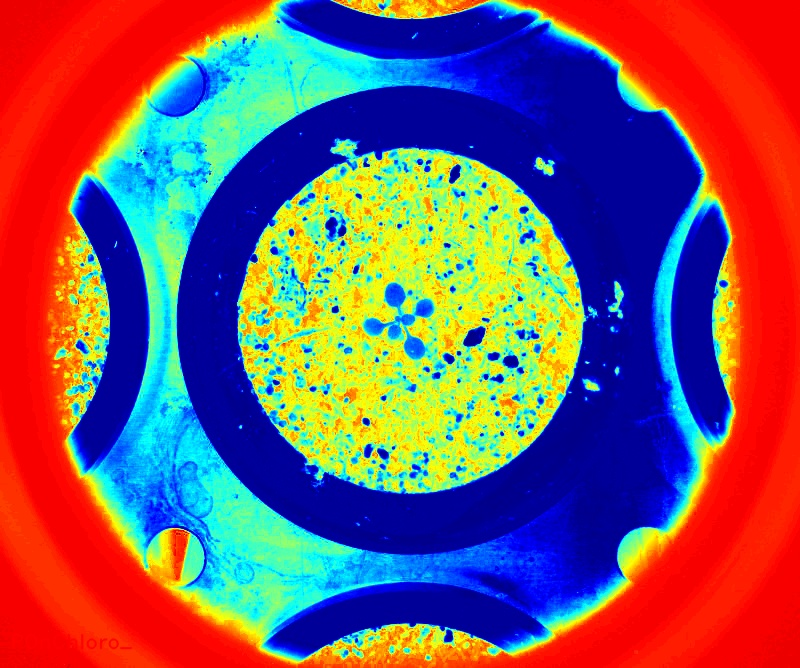

# Calculate chlorophyll

## Description

**Real time**: False

## Usage

- **Visualization**: Visualization tools

## Parameters

- Normalize channel (normalize): (default: 0)
- Select source file type (source_file): no clue (default: source)
- Select pseudo color map (color_map): (default: c_2)
- Overlay text on top of images (text_overlay): Draw description text on top of images (default: 1)

## Example

### Source


### Parameters/Code

Default values are not needed when calling function

```python
from ipapi.ipt import call_ipt

raw_chlorophyll_image = call_ipt(
    ipt_id="IptCalculateChlorophyll",
    source="arabido_sample_plant.jpg",
    return_type="result",
    normalize=1,
    text_overlay=0
)
```

### Result


