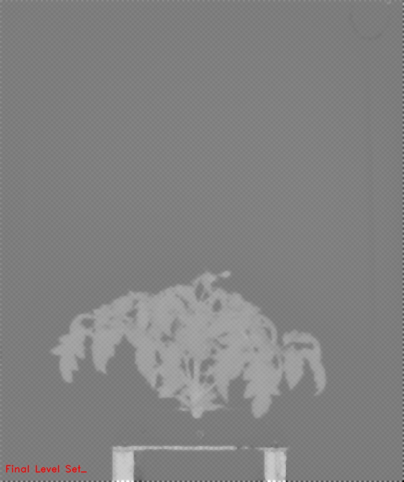

# Chan Vese

## Description

From scikit-image: Chan-Vese segmentation algorithm.<br>Active contour model by evolving a level set.<br>Can be used to segment objects without clearly defined boundaries.<br><br>**Real time**: False

## Usage

- **Threshold**: Creates a mask that keeps only parts of the image

## Parameters

- Channel (channel): (default: h)
- Max iterations (max_iter): (default: 100)
- mu (mu): (default: 25)
- Lambda1 (lambda1): (default: 1)
- Lambda2 (lambda2): (default: 1)
- dt (dt): (default: 25)

## Example

### Source


### Parameters/Code

Default values are not needed when calling function

```python
from ipapi.ipt import call_ipt

channel = call_ipt(ipt_id="IptChanVese",
                   source="tomato_sample_plant.jpg",
                   )
```

### Result


