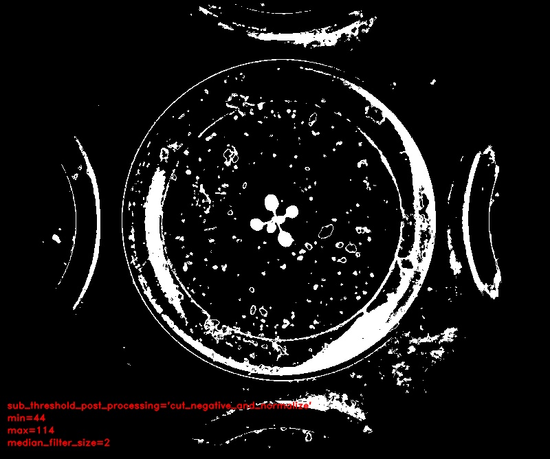

# Channel subtraction

## Description

Creates a new channel by subtracting one channel to another.<br>
**Real time**: True

## Usage

- **Pre-processing**: Transform the image to help segmentation, the image may not retain it's properties. Changes here will be ignored when extracting features

## Parameters

- Channel 1 (channel_1): (default: rd)
- Weight of the first channel (alpha): (default: 100)
- Channel 2 (channel_2): (default: bl)
- Weight of the second channel (beta): (default: 100)
- On result image do (post_processing): Action to perform after subtraction to return an image (default: normalize)
- Threshold min value (min): (default: 0)
- Threshold max value (max): (default: 255)
- Median filter size (odd values only) (median_filter_size): (default: 0)
- Morphology operator (morph_op): (default: none)
- Kernel size (kernel_size): (default: 3)
- Kernel shape (kernel_shape): (default: ellipse)
- Iterations (proc_times): (default: 1)

## Example

### Source


### Parameters/Code

Default values are not needed when calling function

```python
from ipapi.ipt import call_ipt

result, threshold = call_ipt(ipt_id="IptChannelSubtraction",
                             source="arabido_sample_plant.jpg",
                             post_processing='cut_negative_and_normalize',
                             min=44,
                             max=114,
                             median_filter_size=2)
```

### Result


