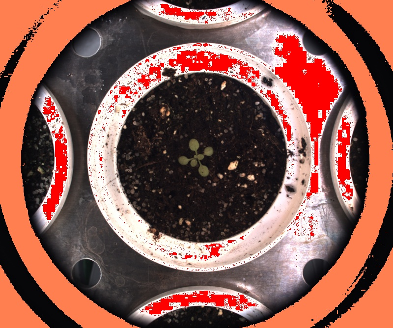

# Check exposure

## Description

Displays over/under exposed parts of the image<br>Also displays average brightness of the image<br>**Real time**: True

## Usage

- **Pre-processing**: Transform the image to help segmentation, the image may not retain it's properties. Changes here will be ignored when extracting features
- **Feature extraction**: Tools to extract features from a segmented image

## Parameters

- Activate tool (enabled): Toggle whether or not tool is active (default: 1)
- Overexposed if over: (overexposed_limit): (default: 255)
- Color for overexposed parts (over_color): (default: red)
- Underexposed if under: (underexposed_limit): (default: 0)
- Color for underexposed parts (under_color): (default: orange)
- Display grey zones (show_grey_zones): (default: 0)
- Grey if more than x apart: (grey_zone_limit): How little different must the 3 components be to be considered grey (default: 0)
- Color for grey parts (grey_zone_color): (default: fuchsia)
- Calculate source brightness on (source_brightness): no clue (default: source)
- Source brightness calculation mode (brg_calc): (default: std)
- Use average brightness as: (average_as): (default: none)
- Apply x factor to auto threshold (avg_weight): (default: 100)
- Overlay text on top of images (text_overlay): Draw description text on top of images (default: 0)

---

- output (src_brightness): Source brightness:
- output (src_contrast): Source contrast:

## Example

### Source


### Parameters/Code

Default values are not needed when calling function

```python
from ipapi.ipt import call_ipt

image = call_ipt(ipt_id="IptExposureChecker",
                 source="arabido_sample_plant.jpg",
                 underexposed_limit=6)
```

### Result


