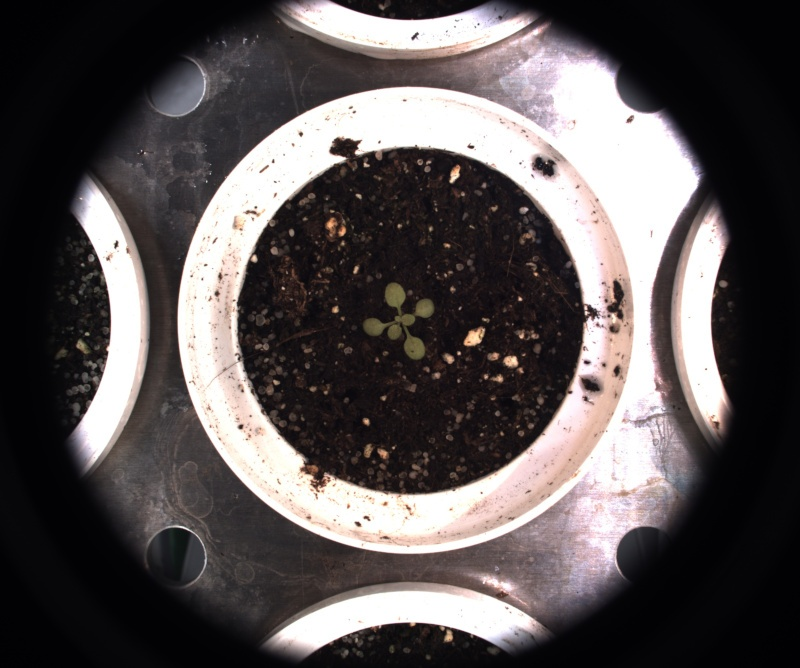

# Check source image

## Description

Checks image and returns error if something is wrong.<br>
**Real time**: True

## Usage

- **Image checking**: Check different aspects of an image

## Parameters

- Show images (show_images): (default: 0)
- Thorough test (thorough_test): (default: 0)
- Print ROIs (print_rois): (default: 0)

## Example

### Source


### Parameters/Code

Default values are not needed when calling function

```python
from ipapi.ipt import call_ipt

image_check = call_ipt(ipt_id="IptCheckSource",
                       source="arabido_sample_plant.jpg",
                       show_images=1)
```

### Result


