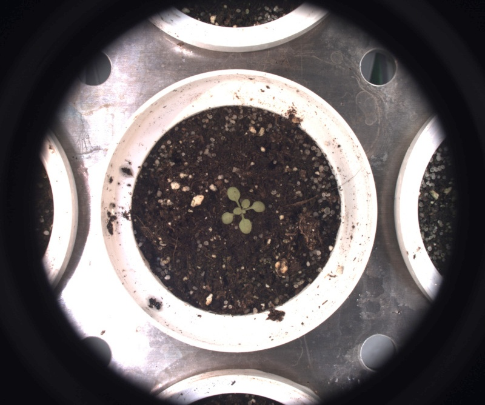

# Copy image

## Description

Copies image to target folder.<br>Can use a ROI as a pre-processor<br>**Real time**: False

## Usage

- **Image generator**: Gives info about current image

## Parameters

- Target folder (target_folder): (default: C:\Users\fmavianemac\Pictures\ipso_phen\)
- Put image in subfolder with experiment as its name (add_sub_folder): (default: 0)
- Image output format (output_format): (default: source)
- Test only, do not actually copy (test_only): (default: 1)
- Source image (original): (default: 1)
- Rotate 90 degres (r90): (default: 0)
- Rotate 180 degres (r180): (default: 0)
- Rotate 270 degres (r270): (default: 0)
- flip horizontally (flip_h): (default: 0)
- flip vertically (flip_v): (default: 0)
- Gamma values (same syntax as grid search) (gamma_values): (default: 1)

---

## Example

### Source


### Parameters/Code

Default values are not needed when calling function

```python
from ipapi.ipt import call_ipt

call_ipt(ipt_id="IptCopyImage",
         source="arabido_sample_plant.jpg",
         original=0,
         r180=1,
         gamma_values='1.50')
```

### Result


