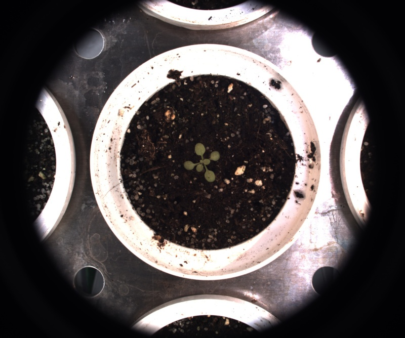

# Copy or rename image

## Description

Copies an image, renaming it if needed
**Real time**: False

## Usage

- **Image generator**: Creates one or more images from a selected image

## Parameters

- Activate tool (enabled): Toggle whether or not tool is active (default: 1)
- Target folder (path): Can be overridden at process call (default: )
- Image to copy (source_image): (default: fixed)
- Custom image name (named_source): (default: mask)
- Image output format (output_format): (default: source)
- Output naming convention (output_name): (default: as_source)
- Prefix or suffix (prefix_suffix): (default: )
- Name of ROI to be used (roi_names): Operation will only be applied inside of ROI (default: )
- ROI selection mode (roi_selection_mode): (default: all_linked)

## Example

### Source


### Parameters/Code

Default values are not needed when calling function

```python
from ipapi.ipt import call_ipt

call_ipt(
    ipt_id="IptCopyOrRenameImage",
    source="arabido_sample_plant.jpg",
    return_type="result",
    path='C:\Users\***\Pictures\ipso_phen_data\saved_images\2019_December_24-102459',
    source_image='source',
    output_format='jpg',
    output_name='hash',
    roi_names='pot_cropper',
    roi_selection_mode='all_named'
)
```

### Result image



### Result data

|        key         |                                    Value                                    |
| :----------------: | :-------------------------------------------------------------------------: |
|       camera       |                                   unknown                                   |
|     date_time      |                             2019-09-06 12:42:11                             |
|      dst_name      |                      bHiZzDyUkeLbtwoi442Ki4iRaZK0.jpg                       |
|      enabled       |                                      1                                      |
|     experiment     |                                   images                                    |
|     image_name     |                           copied_or_renamed_image                           |
|     img_height     |                                     668                                     |
|     img_width      |                                     800                                     |
|        ipt         |                            Copy or rename image                             |
|   ipt_class_name   |                            IptCopyOrRenameImage                             |
|    named_source    |                                    mask                                     |
|   output_format    |                                     jpg                                     |
|    output_name     |                                    hash                                     |
|        path        | C:\Users\*\*\*\Pictures\ipso_phen_data\saved_images\2019_December_24-102459 |
|       plant        |                            arabido_sample_plant                             |
|   prefix_suffix    |                                                                             |
|     roi_names      |                                 pot_cropper                                 |
| roi_selection_mode |                                  all_named                                  |
|    source_image    |                                   source                                    |
|    source_name     |                            arabido_sample_plant                             |
|    view_option     |                                    .jpg                                     |
