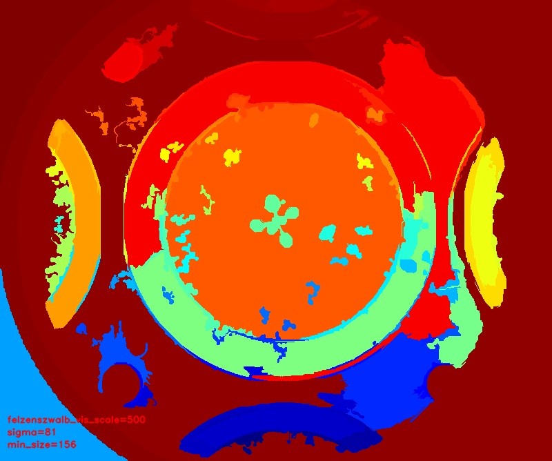

# Felzenswalb

## Description

From scikit-image: Computes Felsenszwalb's efficient graph based image segmentation.<br>**Real time**: False

## Usage

- **Clustering**: Clustering tools

## Parameters

- Select source file type (source_file): no clue (default: source)
- Scale (scale): (default: 100)
- Sigma (sigma): (default: 50)
- Min size (min_size): (default: 50)
- Post process (post_process): (default: none)
- Label merger threshold (hierarchy_threshold): Regions connected by an edge with weight smaller than thresh are merged (default: 35)

## Example

### Source


### Parameters/Code

Default values are not needed when calling function

```python
from ipapi.ipt import call_ipt

labels = call_ipt(ipt_id="IptFelzenswalb",
                  source="arabido_sample_plant.jpg",
                  scale=500,
                  sigma=81,
                  min_size=156)
```

### Result


