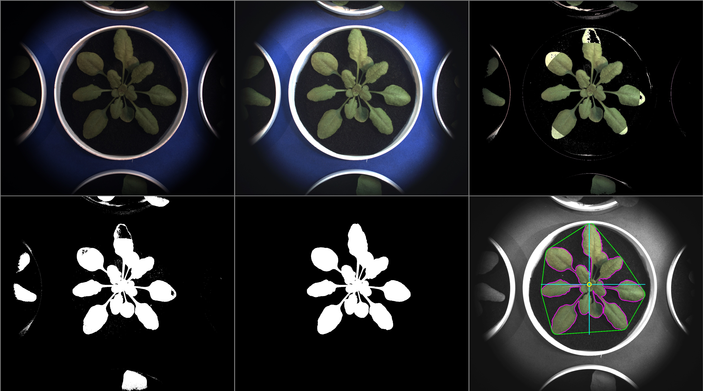

# Fill mask holes

## Description

Fills holes in mask
**Real time**: False

## Usage

- **Mask cleanup**: Cleans a coarse mask generated by threshold tools

## Parameters

- Activate tool (enabled): Toggle whether or not tool is active (default: 1)
- Name of ROI to be used (roi_names): Operation will only be applied inside of ROI (default: )
- ROI selection mode (roi_selection_mode): (default: all_linked)
- Morphology operator (morph_op): (default: none)
- Kernel size (kernel_size): (default: 3)
- Kernel shape (kernel_shape): (default: ellipse)
- Iterations (proc_times): (default: 1)
- Invert mask before filling (invert): Mask will be inverted once again at the end (default: 0)
- Max contour size (max_size): Contour above this size will be ignored (default: 0)
- Min contour size (min_size): Contour below this size will be ignored (default: 0)

## Example

### Source


### Parameters/Code

Default values are not needed when calling function

```python
from ipapi.ipt import call_ipt

mask = call_ipt(
    ipt_id="IptFillMaskHoles",
    source="fill_holes_source.jpg",
    return_type="result"
)
```

### Result


