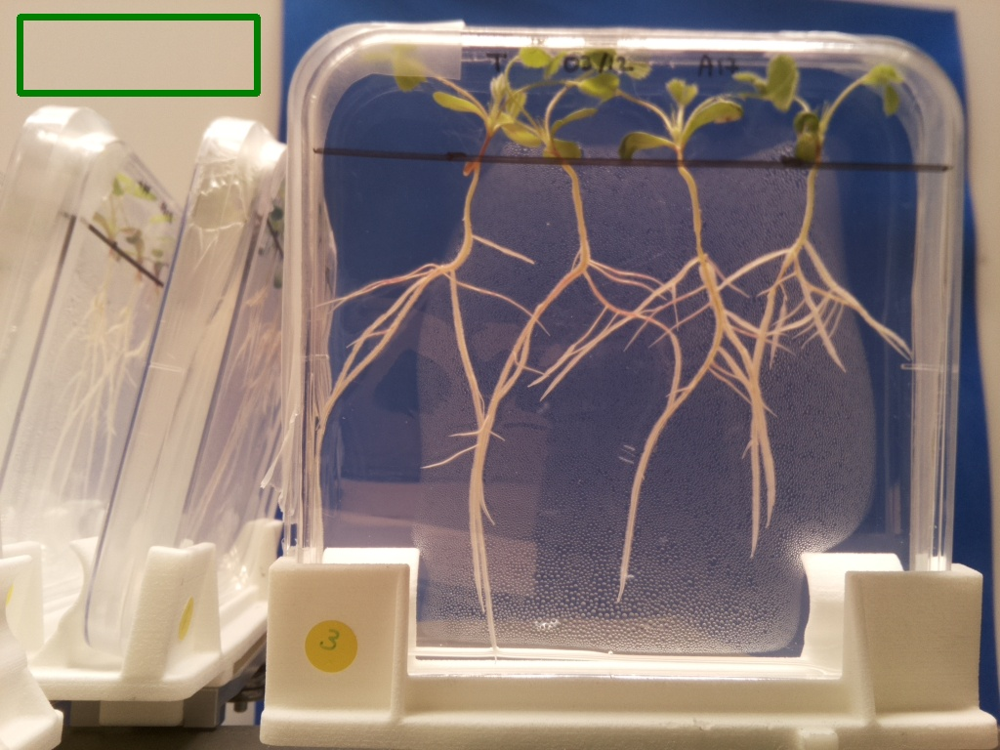
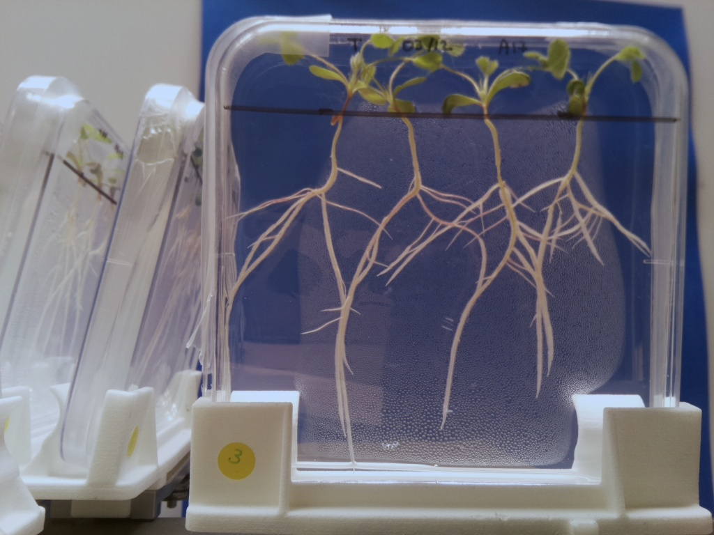

# Fix white balance with ROI

## Description

Fixes image white balance from ROI that is supposed to be white.  
ROI must be present in pipeline.  
Fixes image white balance from ROI that is supposed to be white.  
ROIs must be of type 'keep' or 'delete'.  
Only static ROIs are allowed.

**Real time**: True

## Usage

- **Exposure fixing**: Fix image exposure, the resulting image will be used for color analysis
- **Pre processing**: Transform the image to help segmentation, the image may not retain it's
  properties. Changes here will be ignored when extracting features

## Parameters

- Activate tool (enabled): Toggle whether or not tool is active (default: 1)
- Name of ROI to be used (roi_names): Operation will only be applied inside of ROI (default: )
- ROI selection mode (roi_selection_mode): (default: all_linked)

## Example

### Source



### Parameters/Code

Default values are not needed when calling function

```python
from ipapi.ipt import call_ipt

image = call_ipt(
    ipt_id="IptFixWhiteBalanceWithRoi",
    source="IMG_20191218102649.jpg",
    return_type="result",
    roi_names='white_balance_patch',
    roi_selection_mode='all_named'
)
```

### Result


