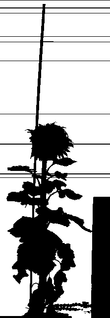
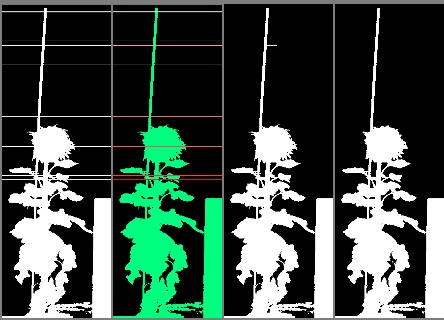

# Horizontal line remover

## Description

Horizontal line remover.  
Developped for Heliasen light barrier.  
Removes horizontal noise lines
**Real time**: False

## Usage

- **Pre processing**: Transform the image to help segmentation, the image may not retain it's
  properties. Changes here will be ignored when extracting features

## Parameters

- Select source file type (source_file): no clue (default: source)
- Channel (channel): (default: l)
- Apply ROIs to source image (is_apply_rois): If true ROIs will be applied to source image (default: 0)
- Only detect isolated lines (fully_isolated): If true, 1 side lines will be ignored (default: 1)
- Min line size p only (min_line_size): (default: 100)
- Build mosaic (build_mosaic): If true edges and result will be displayed side by side (default: 1)
- Morphology operator (morph_op): (default: none)
- Kernel size (kernel_size): (default: 3)
- Kernel shape (kernel_shape): (default: ellipse)
- Iterations (proc_times): (default: 1)

## Example

### Source



### Parameters/Code

Default values are not needed when calling function

```python
from ipapi.ipt import call_ipt

mask = call_ipt(
    ipt_id="IptHorizontalLineDetector",
    source="18HP01V22-CAM11-20180720081100.jpg",
    return_type="result",
    min_line_size=69,
    morph_op='open'
)
```

### Result


