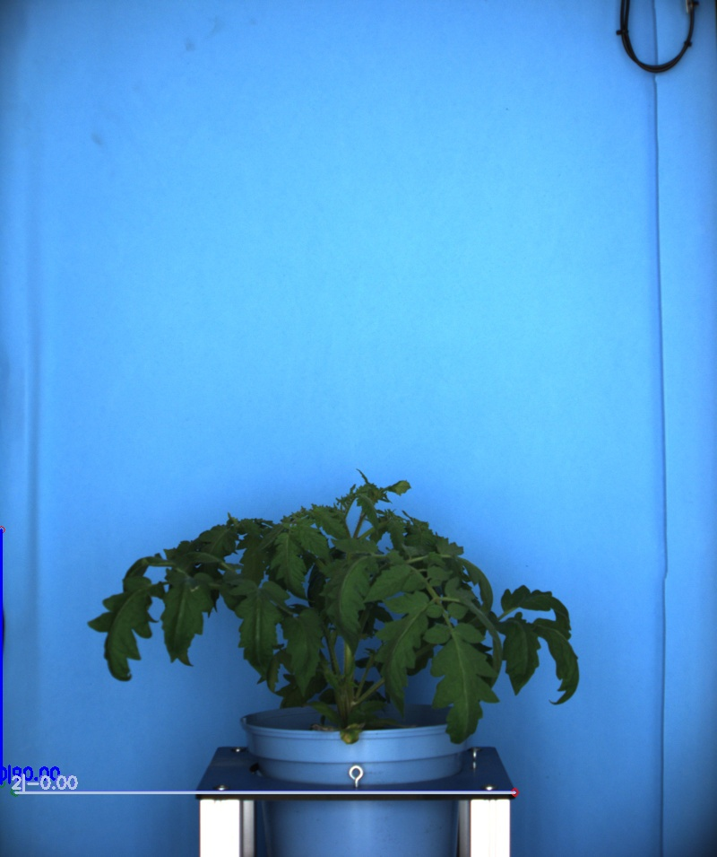

# Hough lines detector

## Description

Use the OpenCV functions HoughLines and HoughLinesP to detect lines in an image.<br>**Real time**: False

## Usage

- **Image info**: Creates one or more images from a selected image
- **Feature extraction**: Tools to extract features from a segmented image

## Parameters

- Select source file type (source_file): no clue (default: source)
- Channel (channel): (default: l)
- Apply ROIs to source image (is_apply_rois): If true ROIs will be applied to source image (default: 0)
- Method (method): (default: probabilistic)
- Votes threshold (P only) (votes_threshold): Probabilistic method only (default: 100)
- Max line Gap (P only) (max_line_gap): Probabilistic method only (default: 100)
- Min line size (P only) (min_line_size): Probabilistic method only (default: 100)
- Minimum line angle (min_angle): 0 and 180 both define an horizontal line (default: 0)
- Maximum line angle (max_angle): 0 and 180 both define an horizontal line (default: 180)
- Discarded lines display color (discarded_color): (default: fuchsia)
- Edge detection only (edge_only): (default: 0)
- Select edge detection operator (operator): (default: canny_opcv)
- Canny's sigma (canny_sigma): Sigma. (default: 2)
- Canny's first Threshold (canny_first): First threshold for the hysteresis procedure. (default: 0)
- Canny's second Threshold (canny_second): Second threshold for the hysteresis procedure. (default: 255)
- Kernel size (kernel_size): (default: 5)
- Threshold (threshold): Threshold for kernel based operators (default: 130)
- Apply threshold (apply_threshold): (default: 1)
- Build mosaic (build_mosaic): If true edges and result will be displayed side by side (default: 0)
- Add line details to output data (add_lines_detail): (default: 0)

## Example

### Source


### Parameters/Code

Default values are not needed when calling function

```python
from ipapi.ipt import call_ipt

lines = call_ipt(ipt_id="IptHoughLines",
                 source="tomato_sample_plant.jpg",
                 votes_threshold=140,
                 max_line_gap=393,
                 min_line_size=12,
                 apply_threshold=0)
```

### Result image



### Result data

|  key  | Value |
| :---: | :---: |

