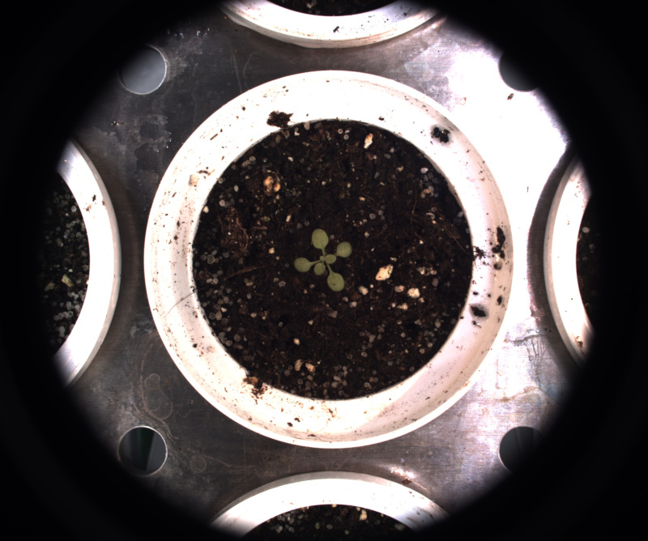

# IPT Demo

## Description

IPT Demo (Image Processing Tool Demo)<br>
A simple showcase of some of the available widgets.<br>
Best starting point if you want to build your own widgets.<br>

**Real time**: True

## Usage

- **Demo**: Demo tools, start here if you want to understand how to create/edit tools

## Parameters

- Output image mode (output_mode): (default: raw)
- A sample checkbox (checkbox): This is a hint (default: 0)
- Sample combobox (combobox): This is a sample combobox (default: a)
- A slider (slider): This is a hint for a slider (default: 25)
- A spin box (spin_box): This is a hint for a slider (default: 75)
- A text input (text_input): This is a hint for the text input (default: Write any text you like)
- This is a button, click to see what happens (button_sample): This is a hint for a sample button (default: 0)
- Channel (channel): (default: h)
- Select pseudo color map (color_map): (default: c_2)
- Select edge detection operator (operator): (default: canny_opcv)
- Canny's sigma (canny_sigma): Sigma. (default: 2)
- Canny's first Threshold (canny_first): First threshold for the hysteresis procedure. (default: 0)
- Canny's second Threshold (canny_second): Second threshold for the hysteresis procedure. (default: 255)
- Kernel size (kernel_size): (default: 5)
- Threshold (threshold): Threshold for kernel based operators (default: 130)
- Apply threshold (apply_threshold): (default: 1)

---

- output (text_output): Text updated 2 times
- output (table_output): ('key', 'value')
- output (adv_txt): Advanced widgets:
- output (cmp_txt): Composit widgets:

## Example

### Source



### Parameters/Code

Default values are not needed when calling function

```python
from ipapi.ipt import call_ipt

call_ipt(ipt_id="IptStub",
         source="arabido_sample_plant.jpg",
         output_mode='false_color',
         slider=22)
```

### Result


